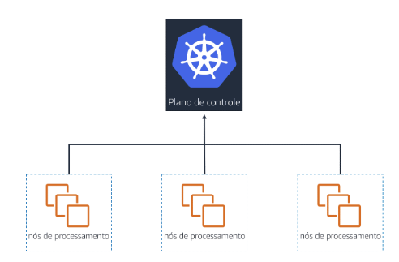
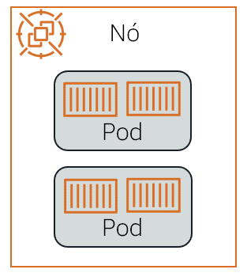
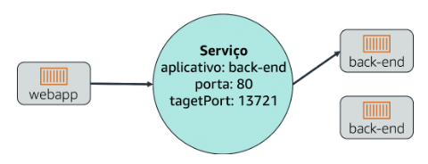
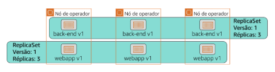
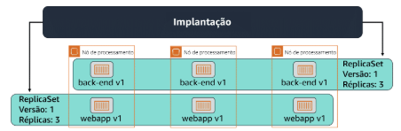
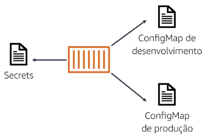
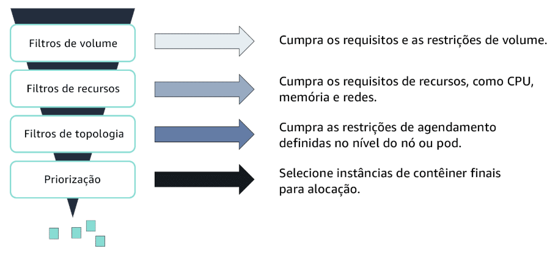
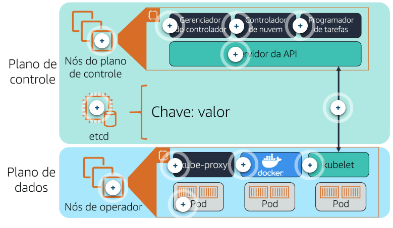

# Kubernetes

Conteúdo:

<!-- TOC start (generated with https://github.com/derlin/bitdowntoc) -->

- [Conceitos básicos](#conceitos-básicos)
  - [Cluster](#cluster)
  - [Node (Nó)](#node-nó)
  - [Ephemeral volume (Volume efêmero)](#ephemeral-volume-volume-efêmero)
  - [Service (Serviço)](#service-serviço)
  - [Namespace](#namespace)
  - [Deployment (Implantação)](#deployment-implantação)
  - [ConfigMap](#configmap)
  - [Segredos](#segredos)
  - [Programação do Pod](#programação-do-pod)
  - [Plano de controle e plano de dados](#plano-de-controle-e-plano-de-dados)
    - [Plano de controle](#plano-de-controle)
    - [Gerenciador do controlador](#gerenciador-do-controlador)
    - [Controlador de nuvem](#controlador-de-nuvem)
    - [Programador de tarefas](#programador-de-tarefas)
    - [Servidor do API](#servidor-do-api)
    - [etcd](#etcd)
    - [Plano de dados](#plano-de-dados)
    - [kube-proxy](#kube-proxy)
    - [Tempo de execução do contêiner](#tempo-de-execução-do-contêiner)
    - [kubelet](#kubelet)
    - [Pods](#pods)
    - [Comunicação do plano de controle/dados](#comunicação-do-plano-de-controledados)
  - [Recursos personalizados](#recursos-personalizados)
  - [kubectl](#kubectl)

<!-- TOC end -->

<!-- TOC -->

## Conceitos básicos

<!-- TOC -->

### Cluster

Cluster: um conjunto de máquinas de trabalho, chamadas de nós, que executam aplicativos em contêiner. Cada cluster tem pelo menos um nó do operador. Um cluster também possui um plano de controle que executa serviços que gerenciam o cluster.

<!-- TOC -->

### Node (Nó)

Node (Nó): o Kubernetes executa a sua carga de trabalho agrupando contêineres em pods e atribuindo esses pods para execução em nós. Um nó pode ser uma máquina virtual ou física, dependendo do cluster. Cada nó é gerenciado pelo plano de controle e contém os serviços necessários para executar os pods.

Pod: um grupo de um ou mais contêineres. Os pods são definidos por um arquivo PodSpec, uma especificação de como executar os contêineres. Os pods são o componente básico do Kubernetes para implantação, scaling e replicação.

<!-- TOC -->

### Ephemeral volume (Volume efêmero)

Ephemeral volume (Volume efêmero): os aplicativos em um pod têm acesso a volumes compartilhados para facilitar o compartilhamento de dados no pod e a persistência de dados nas reinicializações do contêiner. Quando um pod deixa de existir, o Kubernetes destrói volumes efêmeros.

Volume persistente: um volume persistente funciona de maneira semelhante a um volume efêmero, mas tem um ciclo de vida independente de qualquer pod individual que os use. Os volumes persistentes são suportados por subsistemas de armazenamento independentes dos nós do cluster.

<!-- TOC -->

### Service (Serviço)

Service (Serviço): no Kubernetes, um serviço é uma coleção lógica de pods e um meio de acessá-los. O serviço é atualizado continuamente com o conjunto de pods disponíveis, eliminando a necessidade de pods para rastrear outros pods.

<!-- TOC -->

### Namespace

Namespace: um cluster virtual que é apoiado pelo mesmo cluster físico. Os clusters físicos podem ter recursos com o mesmo nome, desde que estejam em namespaces diferentes. Os namespaces são especialmente úteis quando há várias equipes ou projetos usando o mesmo cluster.

<!-- TOC -->

### Deployment (Implantação)

Deployment (Implantação): possui e gerencia ReplicaSets ou pods individuais. Você descreve um estado desejado na implantação. A implantação então altera o estado real do cluster para o estado desejado a uma taxa controlada.

<!-- TOC -->

### ConfigMap

ConfigMap: um ConfigMap é um objeto de API que armazena dados não confidenciais como pares de valores-chave usados por outros objetos do Kubernetes, como pods. Use o ConfigMaps para seguir a prática recomendada de portabilidade, separando seus dados de configuração do código do aplicativo.

<!-- TOC -->

### Segredos

Segredos: todos os dados confidenciais, como credenciais da AWS, devem ser armazenados como segredos do Kubernetes. Os segredos restringem o acesso a informações confidenciais. Opcionalmente, a criptografia pode ser ativada para melhorar a segurança.

<!-- TOC -->

### Programação do Pod

Você pode agendar pods com o programador de tarefas do Kubernetes. O programador de tarefas verifica os recursos necessários para os seus pods e usa essas informações para influenciar a decisão de agendamento. O programador de tarefas executa uma série de filtros para excluir nós inelegíveis para colocação de pod

<!-- TOC -->

### Plano de controle e plano de dados

Plano de controle: os nós do plano de controle gerenciam os nós do operador e os pods no cluster.

Plano de dados: os nós do operador hospedam os pods que são os componentes da carga de trabalho do aplicativo.

<!-- TOC -->

#### Plano de controle

O plano de controle determina quando as tarefas säo agendadas e para onde säo roteadas.

O plano de controle inclui:

- Nós do plano de controle
  - Gerenciador do controlador
  - Controlador de nuvem
  - Programador de tarefas
  - Servidor de API
- etcd

<!-- TOC -->

#### Gerenciador do controlador

O gerenciador do controlador executa encadeamentos em segundo pLano, chamados controladores, gue detectam e respondem a eventos de cluster.

<!-- TOC -->

#### Controlador de nuvem

O controlador de nuvem é um controlador específico que interage com o provedor de nuvem subjacente.

<!-- TOC -->

#### Programador de tarefas

O programador de tarefas seleciona nós para os contêineres recém-criados serem executados.

<!-- TOC -->

#### Servidor do API

O servidor da API do Kubernetes expõe a API do Kubernetes e é o front-end para o plano de controle do Kubernetes. Ele lida com toda a comunicação do cluster para o plano de controle; nenhum dos outros componentes do plano de controle é projetado para expor serviços remotos. 0 servidor da API Kubernetes foi projetado para escalar horizontalmente, implantando mais instancias conforme necessário.

<!-- TOC -->

#### etcd

Essa é a camada de persistência principal do Kubernetes. É um armazenamento de chave-valor distribuído altamente disponível. É aqui que os dados e a estado críticos do cluster são armazenados.

<!-- TOC -->

#### Plano de dados

No Kubernetes, o plano de dados é onde as tarefas sao executadas. Tudo isso é feito nos seus nós de operador.

O plano de dados inclui:

- Nós do operador
  - kube-proxy
  - Tempo de execução do container
  - kubelet
  - Pods

<!-- TOC -->

#### kube-proxy

Isso ajuda na rede. Ele mantém as regras de rede no host e realiza qualquer encaminhamento de conexão que posse ser necessário.

<!-- TOC -->

#### Tempo de execução do contêiner

O Kubernetes oferece suporte a vários tempos de execução, sendo o Docker o mais comum.

<!-- TOC -->

#### kubelet

Este é o agente primário executado nas nós do operador. O Kubelet garante gue os contêineres corretos estejam sendo executados em um pod e que estejam íntegros.

<!-- TOC -->

#### Pods

Um pod é um grupo de um ou mais contêineres. Os contêineres em um pod são sempre colocados juntos, agendados e gerenciados junto; Voce não pode dividir os contêineres de um pod entre os nós. Os aplicativos em um pod podem se comunicar facilmente entre si. Assim como os contêineres de aplicativos individuais, as pods são considerados entidades relativamente efêmeras (em vez de duráveis). Isso significa que os pods podem desaparecer se deixarem de ser íntegros, e novos podem tomar seu lugar.

<!-- TOC -->

#### Comunicação do plano de controle/dados

A comunicação entre o plano de controLe e os nós do operador é feita por meio do servidor de API para o kubelet.

<!-- TOC -->

### Recursos personalizados

Além dos recursos que o Kubernetes define (como pods e implantações), você também pode estender a API do Kubernetes e criar recursos personalizados. Um recurso personalizado pode ser um novo objeto, como um objeto de malha de serviço, ou pode ser uma combinação de recursos nativos do Kubernetes. Os recursos personalizados são criados com uma definição de recurso personalizado (CRD).

Os recursos personalizados podem ser controlados com controladores personalizados. Os controladores customizados são executados em pods nos nós do operador do seu cluster. Quando usados para automatizar o gerenciamento de recursos personalizados em um cluster, os controladores personalizados são chamados de operadores. É uma boa prática usar operadores em vez de atualizar manualmente seus objetos nativos do Kubernetes.

<!-- TOC -->

### kubectl

Você pode se comunicar com os nós do plano de controle usando kubectl. kubectl é uma Command Line Interface (CLI) para comunicação com o servidor da API Kubernetes. Ele fornece comandos para criar recursos, exibir informações detalhadas sobre o cluster e os recursos e acessar ferramentas de solução de problemas. Os comandos kubectl são usados para distribuir, dimensionar e automaticamente dimensionar recursos.

Sintaxe:

`kubectl [command] [TYPE] [NAME] [flags]`

Comando: especifica a operação que você está executando.
Tipo: especifica o tipo de recurso.
Nome: especifica o nome do recurso.
Sinalizador: especifica sinalizadores opcionais.
