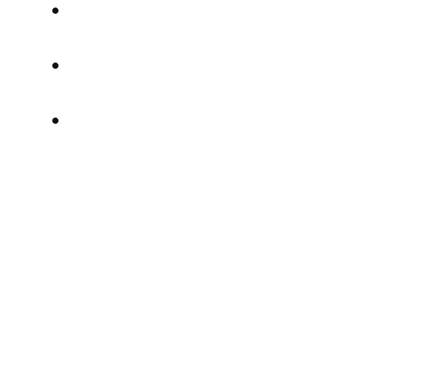
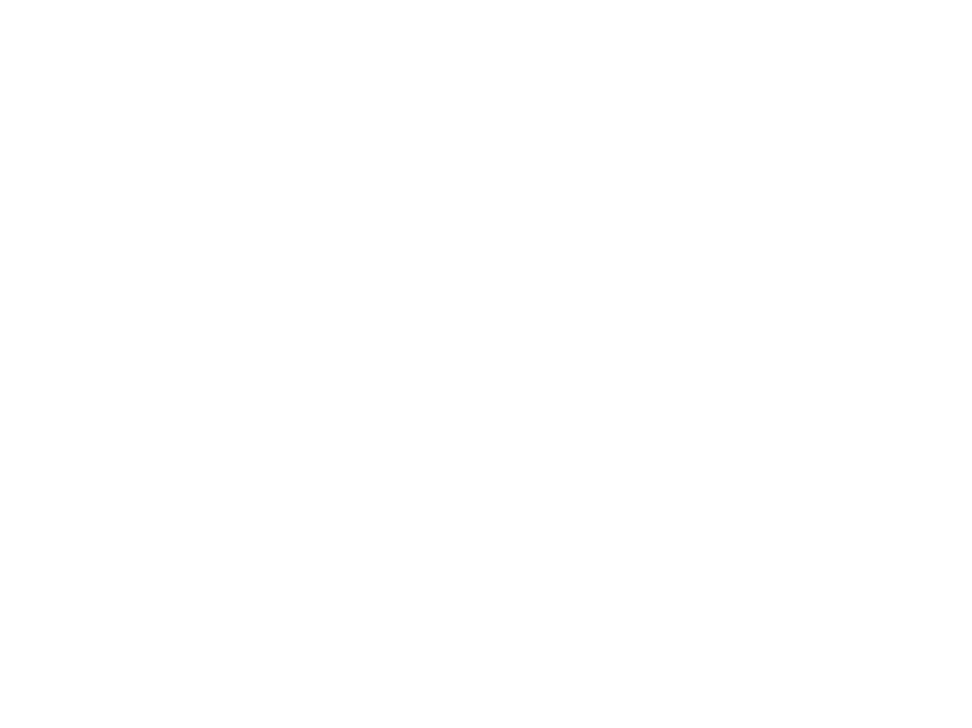

# Clean Architecture

## Introdução

### Arquitetura ou Design?

A palavra "arquitetura" é frequentemente usada no contexto de algo mais alto nível, dissociado dos detalhes práticos, enquanto "design" parece implicar estruturas e decisões em um nível mais básico. Mas esse uso é não faz muito sentido quando se observa o trabalho de um arquiteto de verdade.

Na construção de um software os detalhes de baixo nível e a estrutura de alto nível fazem parte de um mesmo todo. Eles formam um tecido contínuo que define a forma do sistema. Não se pode ter um sem o outro; na verdade, não há uma linha divisória clara que os separe. Existe simplesmente um contínuo de decisões, do nível mais alto ao mais baixo.

O objetivo da Arquitetura de Software é minimizar os recursos humanos necessários para construir e manter um sistema.

Para construir um sistema com um design e uma arquitetura que minimize esforços e maximize produtividade, você precisa saber quais atributos da arquitetura de sistemas levam a este fim.

### Valores do software

Todo sistema de software fornece dois valores diferentes aos seus stakeholder:

* Comportamento: programadores são contratados para fazer máquinas se comportarem de forma a fazer ou economizar dinheiro para os stakeholders.
* Estrutura: o software precisa ser fácil de ser alterado. A dificuldade para se fazer uma mudança deve ser proporcional apenas ao escopo da mudança, não ao “formato” (shape) da mudança.

## Princípios de projeto (Design Principles) - SOLID

Bom software começa com Clean Code.

Entenda o Clean Code como os tijolos de construção que temos as mãos para fazer software. Se os tijolos não estão bem feitos, a arquitetura da construção não importa muito. Por outro lado, ainda podemos fazer um grande bagunça com bons tijolos. É neste ponto que entram os princípios do SOLID.

Os princípios do SOLID nos dizem como organizar nossas funções e dados em classes e como essas classes deveriam estar interconectadas.

O objetivo dos princípios é a criação de estrutura de software a nível de módulos e componentes que:

* Toleram mudanças
* São fáceis de entender
* São a base de componentes que podem ser usados em muitos sistemas de software.

### Single Responsability Principle (SRP)

Lembre-se que o SOLID se aplica a nível de módulos e componentes.

**O módulo deve ter uma, e apenas uma, razão para mudar.** Mas o que isso quer dizer?

Sistemas de software são alterados para satisfazer usuários e stakeholders. Estes são a razão para mudar a que o princípio se
refere. Podemos reescrever o princípio assim: **Um módulo deve ser responsável por um, e apenas um, ator**.

Módulo aqui é entendido como arquivo-fonte (source file)

Se uma determinada classe atende a mais de um ator, ela já está ferindo o SRP. Veja a situação abaixo e uma possível solução.

### Open-Closed Principle (OCP)

O OCP diz que: um artefato de software deve ser aberto para extensão mas fechado para modificação. Ou seja, o comportamento de um artefato de software deve ser extensível, sem que seja necessário modificar o artefato.

Se o componente A deve estar protegido de mudanças feitas no componente B, então o componente B deve depender do componente A.

O OCP é uma das forças de direcionamento por traz da arquitetura de sistemas. O Objetivo é tornar o sistema fácil de estender sem que a mudança incorra em um alto impacto. Este objetivo é alcançado particionando o sistema em componentes e os organizando em hierarquias de dependências que protegem os componentes de alto nível de mudanças em componente de baixo nível.

O diagrama é organizado da seguinte maneira:

* Controller → entrada (HTTP, UI, CLI)
* Interactor → caso de uso (Application Business Rules)
* Presenter → adaptação da saída para a UI
* View → renderização final
* Database → detalhe de infraestrutura

Esses itens são papéis arquiteturais. Eles vêm da evolução de Hexagonal / Ports & Adapters + Use Cases, e o objetivo é isolar regras de negócio de qualquer detalhe de entrega (UI, DB, Web).

A regra de ouro: **todas as dependências apontam para dentro**.

#### Interactor (Use Case)

**Interactor** = implementação de um Caso de Uso.

Ele representa o que o sistema faz, não como ele faz.

Características importantes:

* Contém regras de negócio da aplicação
* Orquestra entidades
* Não conhece:
  * HTTP
  * Framework
  * UI
  * Banco de dados concreto
* Depende apenas de interfaces (ports)

Exemplo conceitual:

CriarPedido
EfetuarPagamento
TransferirSaldo
CadastrarUsuario

Em termos práticos:

* Ele recebe um Input Model (DTO simples)
* Executa o fluxo
* Produz um Output Model
* Chama um Presenter para entregar o resultado

👉 Interactor não retorna ViewModel nem Response HTTP. Ele só executa regras.

#### Presenter

**Presenter** = adaptador da saída do caso de uso para a UI.

Ele existe porque:

* O Interactor não pode saber como os dados serão exibidos
* Cada UI (Web, Mobile, API, CLI) pode precisar de formatos diferentes

Responsabilidades:

* Converter Output Model em algo que a View entenda
* Decidir:
  * mensagens
  * estrutura de dados
  * flags de exibição
* Não contém regra de negócio

Importante:
O Presenter implementa uma interface definida pelo Interactor.

Ou seja:

Interactor → depende de IPresenter

Presenter → conhece ViewModel / DTO de saída

Isso garante o OCP:

você troca a UI sem tocar no caso de uso

Queremos proteger o Controller de mudanças nos Presenters.
Queremos proteger os Presenters de mudanças nas Views.
Queremos proteger o Interactor de mudanças em qualquer lugar.

## old

Fiz um resumo do livro do Robert C. Martin, mas ainda não está no formato Markdown.

PDF neste [link](docs/Meu%20entendimento%20Clean%20Architec%20-%20Jeann%20Andrade.pdf)
