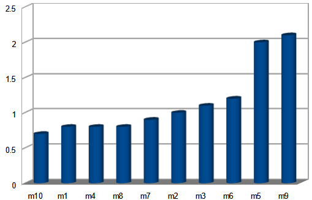

# Data-intensive applications (Table of Contents)

Fontes:

* Este é um resumo do livro [Designing Data-Intensive Applications: The Big Ideas Behind Reliable, Scalable, and Maintainable Systems, do Martin Kleppmann](./docs/f01.pdf).

Índice:

<!-- TOC start (generated with https://github.com/derlin/bitdowntoc) -->

* [Preface](#preface)
* [Glossário](#glossário)
  * [Latência (Latency)](#latência-latency)
  * [Throughput](#throughput)
* [Conceitos fundamentais](#conceitos-fundamentais)
  * [Confiabilidade (Reliability)](#confiabilidade-reliability)
    * [Falhas no hardware](#falhas-no-hardware)
    * [Erros de software](#erros-de-software)
    * [Erros humanos](#erros-humanos)
  * [Escalabilidade (Scalability)](#escalabilidade-scalability)
    * [Mas o que vem a ser carga?](#mas-o-que-vem-a-ser-carga)
    * [E o que vem a ser performance?](#e-o-que-vem-a-ser-performance)
  * [Capacidade de manutenção (Maintainability)](#capacidade-de-manutenção-maintainability)
* [Data Models and Query Languages](#data-models-and-query-languages)
  * [Modelo Relacional versus Modelo baseado em documentos](#modelo-relacional-versus-modelo-baseado-em-documentos)
  * [Modelo Relacional](#modelo-relacional)
  * [Modelo baseado em documentos](#modelo-baseado-em-documentos)
  * [Modelo Hierárquico](#modelo-hierárquico)
  * [Modelo em Rede](#modelo-em-rede)

<!-- TOC end -->

<!-- TOC -->

## Preface

Chamamos um aplicativo de uso intensivo de dados se os dados forem seu principal desafio – a quantidade de dados, a complexidade dos dados ou a velocidade com que eles mudam – em oposição a uso intensivo de computação, onde os ciclos de CPU são o gargalo.

Um aplicativo com uso intensivo de dados normalmente é criado a partir de blocos de construção padrão que fornecem funcionalidades comumente necessárias. Por exemplo, muitos aplicativos precisam:

* Armazenar dados para que eles ou outro aplicativo possam encontrá-los novamente mais tarde (bancos de dados)
* Lembre-se do resultado de uma operação cara, para acelerar leituras (caches)
* Permitir que os usuários pesquisem dados por palavra-chave ou os filtrem de várias maneiras (índices de pesquisa)
* Enviar uma mensagem para outro processo, para ser tratada de forma assíncrona (processamento de fluxo ou "stream processing")
* Processar periodicamente uma grande quantidade de dados acumulados (processamento em lote)

<!-- TOC -->

## Glossário

<!-- TOC -->

### Latência (Latency)

No desenvolvimento de software web, latência se refere ao tempo decorrido entre a ação de um usuário e a resposta do servidor. Essencialmente, é o tempo que os dados levam para viajar da fonte (como o navegador de um usuário) para o destino (como um servidor web) e voltar novamente.

Por exemplo, quando você clica em um link em uma página web, latência é o tempo que o servidor leva para processar essa solicitação e enviar os dados necessários de volta para o seu navegador. Menor latência significa tempos de resposta mais rápidos, o que é crucial para uma boa experiência de usuário.

<!-- TOC -->

### Throughput

No desenvolvimento de software web, throughput se refere à quantidade de dados ou número de transações que um sistema pode processar dentro de um período específico. É uma medida de quanto trabalho pode ser concluído em um determinado período de tempo, geralmente expresso em termos de solicitações por segundo, transações por segundo ou bits/bytes por segundo.

Por exemplo, se um aplicativo web pode lidar com 100 solicitações por segundo, seu throughput é de 100 solicitações por segundo. Um alto throughput indica que o sistema pode processar um grande número de transações rapidamente, o que é crucial para desempenho e escalabilidade.

<!-- TOC -->

## Conceitos fundamentais

<!-- TOC -->

### Confiabilidade (Reliability)

 O sistema deve continuar funcionando corretamente (desempenhando a função correta no nível de desempenho desejado) mesmo diante de adversidades (falhas de hardware ou software, e até erro humano).

 Para software, as expectativas típicas incluem:

* O aplicativo executa a função que o usuário esperava.
* Pode tolerar que o usuário cometa erros ou utilize o software de maneiras inesperadas.
* Seu desempenho é bom o suficiente para o caso de uso necessário, sob a carga e o volume de dados esperados.
* O sistema impede qualquer acesso não autorizado e abuso.

As coisas que podem dar errado são chamadas de falhas (faults), e os sistemas que antecipam as falhas e podem lidar com elas são chamados de tolerantes a falhas ou resilientes.

Observe que uma *fault* não é o mesmo que uma  *failure*. Uma *fault* geralmente é definida como um componente do sistema que se desvia de suas especificações, enquanto uma *failure* ocorre quando o sistema como um todo deixa de fornecer o serviço necessário ao usuário. É impossível reduzir a probabilidade de *fault* a zero; portanto, geralmente é melhor projetar mecanismos tolerância a falhas que evitem que *fault* causem *failure*.

<!-- TOC -->

#### Falhas no hardware

O tema de falha no hardware pode ser tratado de duas maneiras:

* Construindo sistemas que possam tolerar a perda de máquinas inteiras, usando preferencialmente técnicas de tolerância a falhas de software
* Adicionando redundância de hardware

<!-- TOC -->

#### Erros de software

Outra classe de falha é um erro sistemático dentro do sistema:

* Um bug de software que faz com que todas as instâncias de um servidor de aplicativos travem quando recebem uma entrada incorreta específica.
* Um processo descontrolado que consome algum recurso compartilhado
* Um serviço do qual o sistema depende que fica lento, não responde ou começa a retornar respostas corrompidas.
* Falhas em cascata, onde uma pequena falha em um componente desencadeia uma falha em outro componente, que por sua vez desencadeia outras falhas

Não existe uma solução rápida para o problema das falhas sistemáticas de software. Muitas pequenas coisas podem ajudar: pensar cuidadosamente sobre suposições e interações no sistema; testes completos; isolamento de processos; permitindo que processos travem e reiniciem; medir, monitorar e analisar o comportamento do sistema na produção.

<!-- TOC -->

#### Erros humanos

Como podemos tornar nossos sistemas confiáveis, apesar de seres humanos não confiáveis? Os melhores sistemas combinam várias abordagens:

* Projete sistemas de uma forma que minimize as oportunidades de erro. Por exemplo, abstrações, APIs e interfaces administrativas bem projetadas facilitam fazer “a coisa certa” e desencorajam “a coisa errada”.
* Separe os locais onde as pessoas cometem mais erros dos locais onde podem causar falhas. Em particular, forneça ambientes sandbox não produtivos com todos os recursos, onde as pessoas possam explorar e experimentar com segurança, usando dados reais, sem afetar usuários reais.
* Teste minuciosamente em todos os níveis, desde testes unitários até testes de integração de todo o sistema e testes manuais.
* Permita a recuperação rápida e fácil de erros humanos, para minimizar o impacto em caso de falha. Por exemplo, agilize a reversão das alterações de configuração, implante um novo código gradualmente (para que quaisquer bugs inesperados afetem apenas um pequeno subconjunto de usuários) e forneça ferramentas para recalcular os dados (caso se descubra que o cálculo antigo estava incorreto).
* Configure um monitoramento detalhado e claro, como métricas de desempenho e taxas de erro. Em outras disciplinas de engenharia isso é chamado de telemetria.
* Implemente boas práticas de gestão e treinamento.

<!-- TOC -->

### Escalabilidade (Scalability)

 À medida que o sistema cresce (em volume de dados, volume de tráfego ou complexidade), devem existir formas razoáveis de lidar com esse crescimento. Escalabilidade é o termo que usamos para descrever a capacidade de um sistema de lidar com o aumento da carga.

<!-- TOC -->

#### Mas o que vem a ser carga?

Primeiro, precisamos descrever sucintamente a carga atual no sistema; só então podemos discutir questões de crescimento (o que acontece se nossa carga dobrar?). A carga pode ser descrita com alguns números que chamamos de parâmetros de carga. A melhor escolha de parâmetros depende da arquitetura do seu sistema: pode ser solicitações por segundo para um servidor web, a proporção de leituras para gravações em um banco de dados, o número de usuários ativos simultaneamente em uma sala de bate-papo, a taxa de acertos em um cache ou outra coisa. Talvez o caso médio seja o que importa para você, ou talvez seu gargalo seja dominado por um pequeno
número de casos extremos.

<!-- TOC -->

#### E o que vem a ser performance?

Depois de descrever a carga no seu sistema, você pode investigar o que acontece quando a carga aumenta. Você pode olhar para isso de duas maneiras:

* Quando você aumenta um parâmetro de carga e mantém os recursos do sistema (CPU, memória, largura de banda da rede, etc.) inalterados, como o desempenho do seu sistema é afetado?
* Quando você aumenta um parâmetro de carga, quanto você precisa aumentar os recursos se quiser manter o desempenho inalterado?

Ambas as perguntas exigem números de desempenho, então vamos olhar brevemente para descrever o desempenho de um sistema.

Em um sistema de processamento em lote como o Hadoop, geralmente nos importamos com o throughput (rendimento) — o número de registros que podemos processar por segundo ou o tempo total que leva para executar um trabalho em um conjunto de dados de um determinado tamanho. Em sistemas online, o que geralmente é mais importante é o tempo de resposta do serviço — ou seja, o tempo entre um cliente enviar uma solicitação e receber uma resposta.

Como várias requisições ao mesmo serviço apresentam tempo de resposta diferente, devemos observar esses números em uma distribuição. Usando o conceito de percentile, ordenamos o tempos do mais rápido para o mais lento e a média se torna o meio da distribuição.

Nesse caso pode-se dizer que 50% (p50) das requisições foram respondidas em menos que 1s, apesar de terem de ocorridos casos extremos que chegaram aos 2s.

Outros percentiles importantes são p95, p99 e p999 (95%, 99%, 99.9%)  que geralmente atingem os clientes mais volumosos, e portanto que trazem mais renda para a empresa.

<!-- TOC -->

### Capacidade de manutenção (Maintainability)

Com o tempo, muitas pessoas diferentes trabalharão no sistema (engenharia e operações, mantendo o comportamento atual e adaptando o sistema a novos casos de uso), e todas deverão ser capazes de trabalhar nele de forma produtiva.

<!-- TOC -->

## Data Models and Query Languages

A maioria dos aplicativos é construída empilhando camadas de modelos de dados uns sobre os outros. Para cada camada, a questão chave é: como ela é representada em relação a camada imediatamente inferior?

Por exemplo:

1. Como desenvolvedor de aplicativos, você olha para o mundo real (no qual existem pessoas, organizações, bens, ações, fluxos de dinheiro, sensores, etc.) e modela-o em termos de objetos ou estruturas de dados e APIs que manipulam essas estruturas de dados. Essas estruturas geralmente são específicas para sua aplicação.
1. Quando você deseja armazenar essas estruturas de dados, você as expressa em termos de um modelo de dados de uso geral, como documentos JSON ou XML, tabelas em um banco de dados relacional ou um modelo gráfico.
1. Os engenheiros que construíram seu software de banco de dados decidiram uma forma de representar os dados em JSON/XML/relacionais/gráficos em termos de bytes na memória, no disco ou em uma rede. A representação pode permitir que os dados sejam consultados, pesquisados, manipulados e processados ​​de diversas maneiras.
1. Em níveis ainda mais baixos, os engenheiros de hardware descobriram como representar bytes em termos de correntes elétricas, pulsos de luz, campos magnéticos e muito mais.

Existem muitos tipos diferentes de modelos de dados, e cada modelo de dados incorpora suposições sobre como ele será usado. Alguns tipos de uso são fáceis e outros não são suportados; algumas operações são rápidas e outras apresentam desempenho ruim; alguns dados as transformações parecem naturais e algumas são estranhas.

<!-- TOC -->

### Modelo Relacional versus Modelo baseado em documentos

Argumentos para o uso do modelo baseado em documentos:

* Necessidade de armazenar e manter grandes quantidades de dados não estruturados.
* Pode lidar com dados semi-estruturados ou não estruturados, o que os torna mais fáceis de escalar e gerenciar, especialmente para organizações com necessidades massivas de armazenamento de dados.

<!-- TOC -->

### Modelo Relacional

Proposto pro Edgar Codd em 1970, tornou amplamente utilizado em meados de 1980 sendo a ferramenta escolhida pela maioria das pessoas que precisavam armazenar e consultar dados estruturados.

<!-- TOC -->

### Modelo baseado em documentos

Bancos de dados de objetos surgiram e desapareceram no final de 1980, início de 1990. Bancos de dados XML apareceram em meados de 2000, mas tiveram apenas adoção em nichos específicos.

Agora, a partir de 2010, NoSQL (ou Not Only SQL) tem sido a última tentativa pra sobrepor o domínio de modelo relacional.

A maioria dos bancos de dados NoSQL pode conter os quatro tipos de dados a seguir:

* Armazenamento orientado a documentos - Estes permitem um par de chaves com um documento. Os documentos podem conter uma variedade de objetos, como matriz de chaves e pares de valores-chave, bem como outros documentos.
* Armazenamento de valores-chave - São bancos de dados simples que armazenam informações na forma de atributos (chaves) e valores. Em alguns casos, os valores podem ter tipos como “string” ou “inteiro”.
* Armazenamento de grafos - Eles armazenam dados sobre redes em um formato orientado a grafo.
* Armazenamento de colunas largas - Isso ajuda no manuseio de grandes quantidades de dados na forma de colunas.

<!-- TOC -->

### Modelo Hierárquico

<!-- TOC -->

### Modelo em Rede

Em construção
