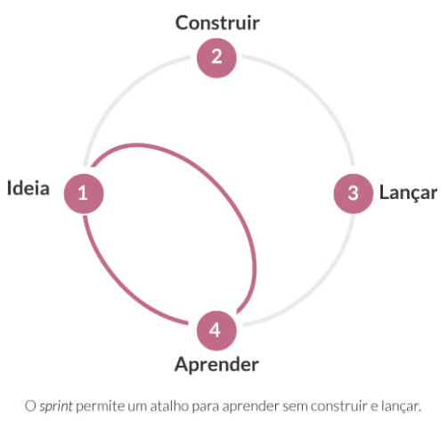

# Design thinking e Design Sprint

Fontes:

* Curso Inter Academy

## Table of contents

<!-- TOC start (generated with https://github.com/derlin/bitdowntoc) -->

* [Motivação](#motivação)
* [Design thinking](#design-thinking)
  * [Imersão](#imersão)
  * [Ideação](#ideação)
  * [Prototipagem](#prototipagem)
* [Design Sprint](#design-sprint)
  * [Como é o processo](#como-é-o-processo)
    * [Dia 1 – Compreender](#dia-1-compreender)
    * [Dia 2 – Divergir](#dia-2-divergir)
    * [Dia 3 – Decidir](#dia-3-decidir)
    * [Dia 4 – Prototipar](#dia-4-prototipar)
    * [Dia 5 – Validar](#dia-5-validar)
  * [Quando não utilizar o design sprint](#quando-não-utilizar-o-design-sprint)

<!-- TOC end -->

<!-- TOC -->

## Motivação

Soluções cada vez mais inovadoras que resolvam um problema e gerem a percepção de valor ao cliente... Esse é o desafio das empresas e dos profissionais que atuam no desenvolvimento de produtos ou serviços.

Pensar e agir como designer, envolve:

* mergulhar em uma situação ou problema, reunindo o máximo de informações possíveis, enxergando o problema como um todo (visão sistêmica);
* refletir sobre essas informações - pontos positivos ou negativos;
* trocar informações com outras pessoas e áreas;
* registrar todas as ideias que tiver (uma boa ideia pode surgir em qualquer lugar e a qualquer momento);
* desenvolver ideias e elaborar soluções, questionando se realmente está no caminho certo;
* selecionar e testar a melhor solução para um problema.

<!-- TOC -->

## Design thinking

Design thinking é uma abordagem associada inicialmente à elaboração de produtos, mas muito utilizada para resolver problemas a partir da imersão no ambiente onde o problema existe, uma vez que, ao colocar o problema no centro do processo, é possível gerar soluções inovadoras e que agreguem valor para as pessoas.

**Frase chave:** O cliente no centro do processo

O processo de design thinking acontece em 3 etapas:

<!-- TOC -->

### Imersão

O primeiro passo para a aplicação do design thinking é compreender o problema e, para isso, é fundamental desenvolver a empatia, se colocar no lugar do cliente, entender quais são os seus desafios e o que ele gostaria de receber para que a situação fosse resolvida.

Todos os dados coletados nessa fase, por meio de entrevistas ou observações, são analisados e sintetizados e são eles que nortearão a criação de soluções na próxima etapa do processo.

<!-- TOC -->

### Ideação

Nesta etapa, são levantadas as possíveis soluções para resolver o problema do cliente. Vale lembrar que uma maior variedade de profissionais envolvidos colaborará com diferentes visões para a solução.

O ideal é que, após esse levantamento inicial, essas soluções sejam afuniladas, selecionando aquelas que mais se aproximem do contexto do cliente.

A partir daí, se começa a criar e desenhar as soluções, descrever as funcionalidades, definir exatamente como a questão do cliente será resolvida.

<!-- TOC -->

### Prototipagem

Definida a solução, é hora de tangibilizar a ideia, de forma a representá-la, mesmo que de modo simplificado, por meio de um protótipo.

A partir desse momento, é possível validar as ideias geradas para a solução do problema, ver o que se encaixa no projeto, acrescentar o que falta e aparar as arestas.

Somente após estas 3 etapas, o processo segue para a Materialização

Após ser testada e aprovada, a solução será construída e implementada. A ideia é que essa implementação seja a menor possível e traga valor para o cliente. Essa solução é conhecida como MVP (Minimum Viable Product), que significa produto mínimo viável.

Em outras palavras, a solução vai trazer tudo aquilo que não pode deixar de existir e nada mais além disso. Soluções maiores, com funcionalidades além do que o necessário para resolver o problema, nem sempre vão trazer a percepção de valor agregado ao cliente.

A partir da materialização, começa o teste e monitoramento. À medida que a solução cresce – com dados e evidências daquilo que o cliente realmente deu importância – novas soluções são criadas, desenhadas e implementadas.

De posse desses dados, novos ciclos desse processo podem ser realizados, gerando uma abordagem contínua para o desenvolvimento do produto.

<!-- TOC -->

## Design Sprint

Um outro processo que utiliza os pensamentos e métodos do design na geração de soluções inovadoras é o design sprint, composto por parte do processo de design thinking e parte da concepção dos métodos ágeis, como o Scrum.

**Frase chave:** a ideia do design sprint é gerar uma solução em, no máximo, 40 horas (5 dias).

o foco do design sprint é na validação da ideia com usuários – o que encurta o processo e evita que muito tempo e trabalho sejam investidos nela.

O método aproxima clientes, usuários e fornecedores, pois se parte do princípio de que é importante que o cliente participe do processo de construção da solução.

Em função disso, a ideia é que o produto gerado, ou pelo menos o protótipo gerado ao final desses 5 dias, seja muito próximo às necessidades de quem vai utilizar o produto pronto, otimizando tempo e investimentos.

<!-- TOC -->

### Como é o processo

<!-- TOC -->

#### Dia 1 – Compreender

Momento de exteriorizar tudo o que a equipe que vai participar do processo sabe sobre a ideia, uma vez que as expertises estão em várias cabeças que precisam estar alinhadas para o sucesso da solução.

<!-- TOC -->

#### Dia 2 – Divergir

Momento de elaborar ideias de forma individual e, posteriormente, em grupo para discutir o funcionamento do que foi proposto, selecionando as melhores soluções.

<!-- TOC -->

#### Dia 3 – Decidir

Com as ideias selecionadas, esse é o momento de filtrá-las, refiná-las e escolher a ideia que será prototipada.

<!-- TOC -->

#### Dia 4 – Prototipar

Este é o momento de ser absurdamente produtivo, selecionando de preferência ferramentas com as quais já se tem o hábito de trabalhar, pois a ideia é montar o protótipo até o fim do dia.

<!-- TOC -->

#### Dia 5 – Validar

Momento de mostrar os protótipos aos potenciais usuários, de forma individual e colhendo os feedbacks. Após todos os testes, os feedbacks são analisados e se decide se a ideia vai em frente ou não.

<!-- TOC -->

### Quando não utilizar o design sprint

* Quando o produto já está muito bem definido - Quando o conceito de um produto já está validado e a equipe já pode executá-lo, não é necessário passar por uma rodada de design sprint. O ideal é que ele seja utilizado para explorar possibilidades de melhoria, relações ou mudanças, que auxiliarão na implementação de novas funcionalidades.
* Quando é necessária uma quantidade significativa de pesquisa - O design sprint necessita de insumos na forma de dados. Isso significa realizar entrevistas com clientes para entender quem eles são, como usam o seu produto, o que querem. Antes de iniciar uma etapa de design sprint, é importante considerar pesquisas, etnografias ou entrevistas de usuários.
* Quando o escopo ainda está muito aberto - Antes de começar uma etapa de design sprint é necessário saber a área do problema. Mesmo que ele funcione como um mecanismo de restrição de escopo e como forma de aumentar o foco, se a tarefa for muito grande, é possível que não seja realizada em uma semana.
