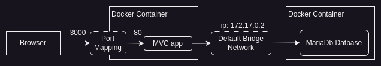
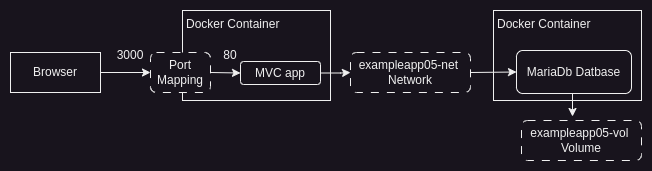

# Hands-On Docker

1. [Exercício 1 - ASP.NET - Demonstração prática do ciclo de build, login, push e run](#exercício-1)
1. [Exercício 2 - Dockerfile - demonstrando o problema de não ter um volume](#exercício-2)
1. [Exercício 3 - Dockerfile - demonstrando o uso do volume](#exercício-3)
1. [Exercício 4 - ASP.NET - Aplicação acessando o banco sem compose](#exercício-4)
1. [Exercício 5 - ASP.NET - Aplicação acessando o banco com compose](#exercício-5)

## Exercício 1

Código Fonte [aqui](https://gitlab.com/jeann-andrade/dockerexamples/-/tree/main/ExampleApp?ref_type=heads)

Nesse exercício é usado um Dockerfile clássico de multi-stage build, otimizado para gerar uma imagem final enxuta. A explicação linha a linha segue abaixo:

```dockerfile
FROM mcr.microsoft.com/dotnet/sdk:10.0 AS build
WORKDIR /src

COPY ["ExampleApp.csproj", "./"]
RUN dotnet restore "ExampleApp.csproj"

COPY . .
RUN dotnet publish "ExampleApp.csproj" -c Release -o /app/publish /p:UseAppHost=false

FROM mcr.microsoft.com/dotnet/aspnet:10.0 AS final
WORKDIR /app
COPY --from=build /app/publish/ ./

ENV ASPNETCORE_URLS=http://+:80
EXPOSE 80/tcp

ENTRYPOINT ["dotnet", "ExampleApp.dll"]
```

Vou explicar linha por linha. É um Dockerfile clássico de **multi-stage build**, otimizado para gerar uma imagem final enxuta.

### Estágio 1 — `build`

```dockerfile
FROM mcr.microsoft.com/dotnet/sdk:10.0 AS build
```
Usa a imagem oficial do **SDK do .NET 10** (contém compilador, ferramentas de restore/build/publish) como base desse estágio, apelidado de `build`. Essa imagem é pesada, mas só existe temporariamente durante o build da imagem Docker.

```dockerfile
WORKDIR /src
```
Define `/src` como diretório de trabalho dentro do container — os comandos seguintes rodam a partir dali.

```dockerfile
COPY ["ExampleApp.csproj", "./"]
RUN dotnet restore "ExampleApp.csproj"
```
Aqui está a parte mais estratégica: copia **apenas o `.csproj`** antes do resto do código, e roda o `dotnet restore` (baixa os pacotes NuGet). Isso é feito de propósito separado do `COPY . .` para aproveitar o **cache de camadas do Docker** — se você só mudar código-fonte (não as dependências), o Docker reaproveita a camada de restore em builds futuros, economizando bastante tempo.

```dockerfile
COPY . .
RUN dotnet publish "ExampleApp.csproj" -c Release -o /app/publish /p:UseAppHost=false
```
Agora copia todo o restante do código-fonte e roda o `dotnet publish`:
- `-c Release` → build em modo Release (otimizado, sem símbolos de debug).
- `-o /app/publish` → coloca a saída publicada nesse diretório.
- `/p:UseAppHost=false` → não gera o executável nativo específico da plataforma (ex: `ExampleApp.exe`/binário nativo), já que a aplicação vai rodar via `dotnet ExampleApp.dll` na imagem final — isso economiza espaço.

### Estágio 2 — `final`

```dockerfile
FROM mcr.microsoft.com/dotnet/aspnet:10.0 AS final
```
Troca para a imagem **ASP.NET Runtime** (bem menor que o SDK), que só tem o necessário para *executar* uma aplicação ASP.NET Core — sem ferramentas de build. Esse é o segredo do multi-stage: o SDK gigante fica só no estágio 1 e nunca vai pra imagem final.

```dockerfile
WORKDIR /app
```
Define `/app` como diretório de trabalho no container final.

```dockerfile
COPY --from=build /app/publish/ ./
```
Copia **somente os artefatos publicados** do estágio `build` (não o código-fonte, não os pacotes NuGet intermediários) para dentro da imagem final. Isso é o que mantém a imagem final pequena.

```dockerfile
ENV ASPNETCORE_URLS=http://+:80
```
Define a variável de ambiente que diz ao Kestrel (servidor web embutido do ASP.NET Core) para escutar em todas as interfaces (`+`) na porta 80.

```dockerfile
EXPOSE 80/tcp
```
Apenas **documenta** que o container expõe a porta 80/TCP — não abre a porta de fato (isso é feito com `-p` no `docker run` ou `ports:` no compose), mas ajuda quem for rodar o container a saber o que mapear.

```dockerfile
ENTRYPOINT ["dotnet", "ExampleApp.dll"]
```
Comando que roda quando o container inicia: executa a DLL publicada usando o runtime do .NET. Formato *exec* (array), então sinais como `SIGTERM` são recebidos diretamente pelo processo `dotnet` — importante para shutdown gracioso.

---

**Resumindo a lógica geral:** o estágio `build` compila tudo com o SDK completo, e o estágio `final` fica só com o runtime + os arquivos publicados — resultando numa imagem final bem mais leve do que se você usasse a imagem do SDK pra rodar a aplicação também.

### Quais aspectos do docker o exercício cobre?

- [x] uso de dockerfile
- [x] criação de imagem
- [ ] criação de volume
- [ ] criação de rede (network)
- [ ] uso de compose
- [ ] uso de swarm
- [x] publicação em docker hub
- [x] rodando container em play with docker

### Passo a passo para rodar o exemplo

Passo 1 - criar a imagem a partir do arquivo Dockerfile disponível na pasta raiz do projeto

`docker build . -t jeannandrade01/exampleapp -f Dockerfile`

Passo 2 - Verificar se imagem foi criada

`docker images`

Passo 3 - Fazer login no docker hub

`docker login`

Passo 4 - Subir a imagem criada para o docker hub

`docker push jeannandrade01/exampleapp:latest`

Passo 5 - Criar um container a partir da imagem do docker hub

Aqui tem um problema, parece que o "PLay With Docker" não existe mais, então vou rodar local:

`docker run -d --name web1 -p 8080:80 jeannandrade01/exampleapp:latest`

## Exercício 2

Código Fonte [aqui](https://gitlab.com/jeann-andrade/dockerexamples/-/tree/main/ExampleApp02?ref_type=heads)

Nesse exercício dados estão sendo armazenados no sistema de arquivos do container. O objetivo é mostrar o problema criado por não fazer uso de volume.

- [x] uso de dockerfile
- [x] criação de imagem
- [ ] criação de volume
- [ ] criação de rede (network)
- [ ] uso de compose
- [ ] uso de swarm
- [ ] publicação em docker hub
- [x] rodando container em play with docker

Passo 1 - Clonar o projeto no Play With Docker e criar a imagem a partir do arquivo Dockerfile disponível na pasta raiz do projeto

`docker build . -t vtest -f Dockerfile.volumes`

Passo 2 - Rodar um container para ver que um arquivo foi de fato criado no filesystem do container

`docker run --name vtest vtest`

Passo 3 - Iniciar o container novamente para ver que o arquivo ainda existe

`docker start -a vtest`

Passo 4 - Remover o container, apagando seu conteúdo

`docker rm -f vtest`

Passo 5 - Criar um novo container para ver que o arquivo se perdeu, tendo o container criado um novo

`docker run --name vtest vtest`

## Exercício 3

Código Fonte [aqui](https://gitlab.com/jeann-andrade/dockerexamples/-/tree/main/ExampleApp03?ref_type=heads)

Nesse exercício dados estão sendo armazenados no volume. O objetivo é mostrar o problema citado no exercício 2 foi resolvido.

- [x] uso de dockerfile
- [x] criação de imagem
- [x] criação de volume
- [ ] criação de rede (network)
- [ ] uso de compose
- [ ] uso de swarm
- [ ] publicação em docker hub
- [x] rodando container em play with docker

Passo 1 - Clonar o projeto no Play With Docker e criar a imagem a partir do arquivo Dockerfile disponível na pasta raiz do projeto

`docker build . -t vtest -f Dockerfile.volumes`

Passo 2 - Criar o volume no host

`docker volume create --name testdata`

Passo 3 - Rodar um container associando o volume do Host com o volume esperado no *Dockerfile*

`docker run --name vtest2 -v testdata:/data vtest`

Passo 4 - Remover o container, apagando seu conteúdo

`docker rm -f vtest2`

Passo 5 - Criar um novo container para ver que o arquivo continua lá, não foi perdido com a exclusão do container

`docker run --name vtest vtest`

## Exercício 4

Código Fonte [aqui](https://gitlab.com/jeann-andrade/dockerexamples/-/tree/main/ExampleApp04?ref_type=heads)

Nesse exercício os dados estão sendo armazenados em volume. Uma aplicação ASP.NET vai rodar acessando um DB MariaDb rodando em outro container. A comunicação entre os containers é feita através da rede bridge padrão (Default Bridge Network) que tem duas limitações principais: é preciso executar o comando `docker network inspect bridge` para saber o IP atribuído ao container e, todos os containers da solução estarão na mesma rede, o que não é uma boa prática quando se trabalha com docker.

- [x] uso de dockerfile
- [x] criação de imagem
- [x] criação de volume
- [ ] criação de rede (network)
- [ ] uso de compose
- [ ] uso de swarm
- [ ] publicação em docker hub
- [x] rodando container em play with docker

Passo 1 - Clonar o projeto no Play With Docker e criar a imagem a partir do arquivo Dockerfile disponível na pasta raiz do projeto

`docker build . -t aspnet_ex04 -f Dockerfile`

Passo 2 - Criar o volume no host

`docker volume create --name productdata`

Passo 3 - Criar o container do banco MariaDb

`docker run -d --name mariadb -v productdata:/var/lib/mysql --env MARIADB_USER=example-user --env MARIADB_PASSWORD=my_cool_secret --env MARIADB_DATABASE=products --env MARIADB_ROOT_PASSWORD=my-secret-pw  mariadb:11.1.2`

Passo 4 - Inspecionar o container do banco para ver qual ip o docker atribuiu a ele

`docker network inspect bridge`

Passo 5 - Rodar um segundo container com a aplicação ASP.NET a partir da imagem criada alterando o IP do DBHost

`docker run -d --name productapp -p 3000:80 -e DBHOST=172.17.0.2 aspnet_ex04:latest`

Passo 6 - Examinar o log do container para ver os comandos sendo executados

`docker logs -f productapp`

Veja a composição de rede criada pelo docker para este exercício. O uso da rede Bridge para conectar os dois containers.



O navegador envia sua requisição HTTP para a porta 3000 no sistema operacional host que o Docker mapeia para a porta 80 no contêiner do aplicativo MVC. O aplicativo MVC solicita que o Entity Framework Core forneça dados, o que ele faz usando a rede bridge padrão para se comunicar com o aplicativo MariaDb em execução em um contêiner separado.

## Exercício 5

Código Fonte [aqui](https://gitlab.com/jeann-andrade/dockerexamples/-/tree/main/ExampleApp05?ref_type=heads)

Nesse exercício está sendo usado o *docker compose* para lidar com a criação das imagens, contêineres, volumes e redes. Uma aplicação ASP.NET vai rodar acessando um DB MariaDb rodando em outro container. A comunicação entre os containers foi feita configurando o recurso de redes. A execução dos contêineres também ficará a cargo do compose, que automatizará todo o trabalho manual feito no exercício anterior.

- [x] uso de dockerfile
- [x] criação de imagem
- [x] criação de volume
- [x] criação de rede (network)
- [x] uso de compose
- [ ] uso de swarm
- [ ] publicação em docker hub
- [x] rodando container em play with docker

Passo 1 - Clonar o projeto no Play With Docker e rodar o comando a seguir de dentro da pasta ExampleApp05

`docker compose up -d`



O navegador envia sua requisição HTTP para a porta 3000 no sistema operacional host que o Docker mapeia para a porta 80 no contêiner do aplicativo MVC. O aplicativo MVC solicita que o Entity Framework Core forneça dados, o que ele faz usando a rede *exampleapp05-net* para se comunicar com o aplicativo MariaDb em execução em um contêiner separado.
