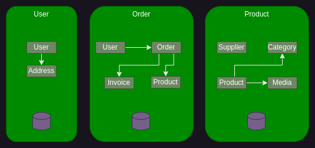
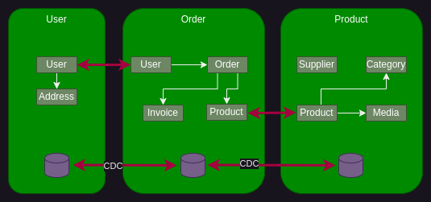

# Microsserviço

Fontes: Microservices: The big picture, Antonio Gonçalves, PluralSight

* Comparação entre arquitetura de microsserviço e arquitetura de monólito
* Como o ciclo de desenvolvimento de software pode ser afetado pela escolha entre estas abordagem
* Terminologia e microsserviço
* Conceitos e padrões de design utilizados em microsserviço
* Prós e contras de microsserviço

## Ciclo de vida do desenvolvimento de software

Independente do modelo seguido, o desenvolvimento de software tem um ciclo de vida que faz com que um software chegue até o ambiente de produção. Esse processo envolve pessoas para desenhar, desenvolver, por e executar o software em produção. microsserviço impacta este ciclo de desenvolvimento, seja na tecnologia, na organização da equipe ou na forma em como você roda o seu software em produção.

1. Durante a fase de análise, reunimos os requisitos. Durante os primeiros sprints, esta é a base da aplicação que define os requisitos mínimos para fazer a aplicação decolar.
2. Depois vem a fase de planejamento e design, onde planejamos esse sprint para garantir que podemos atender aos requisitos no cronograma determinado, bem como extrair os elementos de design dos requisitos.
3. A fase de desenvolvimento é a mais longa. É aqui que entramos em ação e desenvolvemos tudo o que foi planejado. Isso anda de mãos dadas com a fase de testes.
4. Ao final deste sprint, liberamos todos os recursos planejados em produção. Agora o produto está vivo e funcionando. É aí que nossos clientes começam a usar nosso aplicativo que agora precisa ser monitorado.
5. Esta é uma fase importante, pois nos dará algum feedback sobre como nossos clientes utilizam o aplicativo. Com base nesses resultados, podemos construir uma lista de requisitos para a próxima iteração.
6. E é claro que no longo prazo teremos que manter o aplicativo.

Durante este ciclo de vida de desenvolvimento, várias pessoas diferentes estão envolvidas:

1. Usuários e analistas de negócios reunirão seus requisitos e anotarão as histórias de usuários para um determinado sprint.
2. Desenvolvedores, web designers e arquitetos projetarão e desenvolverão o software.
3. Os gerentes de projeto coordenarão o projeto e garantirão a sincronização de todos, para que a meta possa ser alcançada.
4. Uma vez em produção, a equipe operacional é responsável por monitorar, lidar com a segurança e garantir que o software esteja funcionando 24/7.

Uma organização normalmente terá vários desses projetos, maiores, menores, execuções cruciais, funcionando 24/7, projetos paralelos executados apenas em determinadas ocasiões. Podem ser relacionados ou não, desenvolvidos em diferentes países por diferentes equipes. Cada projeto é em sua maioria independente, então alguns podem ter usado uma abordagem em cascata, outros ágeis. Alguns projetos podem levar algumas semanas para serem construídos, outros, alguns anos. Alguns terão sucesso e outros falharão. O projeto seguinte se transformará em software. E, finalmente, cada software será implantado. Alguns serão implantados em servidores ou máquinas virtuais, outros serão implantados diretamente na nuvem. Este é um rápido resumo do que a maioria das empresas de TI faz ao construir software. Microsserviços também são softwares e seguem aproximadamente o mesmo ciclo de vida de desenvolvimento, com algumas pequenas alterações.

## O que são Microsserviços?

O termo microsserviços descreve um estilo de desenvolvimento de software que cresceu a partir de tendências recentes para estabelecer práticas destinadas a aumentar a velocidade e a eficiência do desenvolvimento e gerenciamento de soluções de software em escala. Este conjunto de práticas é agnóstico em termos de tecnologia, tata-se mais de aplicar um certo número de princípios e padrões arquitetônicos que finalmente criarão uma arquitetura de microsserviços.

É importante entender que:

* Cada microsserviço deve fazer uma coisa e fazê-lo bem. Portanto, o micro refere-se ao escopo da funcionalidade do serviço.
* Um microsserviço é um serviço construído em torno de um recurso de negócios específico, **que pode ser implantado de forma independente**. Chamamos isso de contexto delimitado.
* Os microsserviços são desenvolvidos e implantados de forma independente. Cada microsserviço é implantado à sua maneira e em seu próprio ritmo. E como os microsserviços precisam interagir entre si, eles trocam mensagens entre eles.
* Portanto, para construir um aplicativo corporativo de grande porte, precisamos identificar os subdomínios do nosso domínio comercial principal e construir cada subdomínio como um microsserviço. Por exemplo, um aplicativo de comércio eletrônico tem um domínio grande, mas pensando bem, você pode dividi-lo em vários subdomínios menores, como gerenciamento de usuários, catálogo, faturamento e assim por diante.

Um serviço é um componente de código limitado implementável de forma independente que oferece suporte à interoperabilidade por meio de comunicação baseada em mensagens. James Lewis e Martin Fowler, ambos da Thoughtworks, foram quem cunharam o termo microsserviço. A definição original que eles deram diz: o estilo arquitetural de microsserviços é uma abordagem para desenvolver um único aplicativo como um conjunto de pequenos serviços, cada um executando seu próprio processo e se comunicando com mecanismos leves. Por mecanismos leves, eles queriam dizer recursos HTTP. Esses serviços são construídos em torno de capacidades de negócios, o famoso contexto delimitado, e podem ser implantados de forma independente.

Sam Newman, também da Thoughtworks, tem uma definição mais concisa, microsserviços são serviços pequenos e autônomos que funcionam juntos. Esta citação enfatiza o nível de independência, o escopo delimitado e a decomposição de uma aplicação em serviços altamente coesos e pouco acoplados.

A maneira como desenvolvemos software é basicamente um projeto que resulta em um produto, um aplicativo, que é um software. Quanto maior o projeto, maior será o seu ciclo de vida. Pode levar alguns meses ou anos para reunir os requisitos e realmente lançá-lo em produção. Quanto maior o projeto, maiores serão as equipes, pois você precisa de mais pessoas para projetar, mais pessoas para desenvolver e mais pessoas para testar. Vamos chamar esse grande software de monólito por enquanto. Agora, se você conseguir dividir esse monólito em microsserviços menores, poderá se concentrar em algo menor. O ciclo de vida de desenvolvimento ainda é o mesmo, com as mesmas fases diferentes pelas quais deve passar. Mas um projeto menor itera mais rápido desde os requisitos até o desenvolvimento e a liberação para produção. Isso é bom para o tempo de lançamento no mercado. Um projeto menor também significa uma equipe menor. Na verdade, em vez de ter várias equipes localizadas em escritórios diferentes, cada uma trabalhando em sua tarefa e não se comunicando muito com as outras equipes, você pode ter uma única trabalhando em estreita colaboração.

Os microsserviços vão obrigar você a ser mais ágil, aos demais usuários, aos desenvolvedores, à equipe operacional, à equipe de QA, todos juntos trabalhando no mesmo produto. Mas é claro, se você subdividiu um aplicativo em partes menores, isso significa que você acabará com vários projetos vivendo em paralelo. Por serem pequenos, todos se beneficiarão por terem equipes pequenas, ciclo de vida de desenvolvimento mais rápido e chegarem à produção no prazo. Cada microsserviço vive de forma independente, mas todos dependem uns dos outros. Ser pequeno em termos de funcionalidades de negócio significa que você precisa interagir com outros microsserviços, para que todos juntos possam realizar as tarefas da sua aplicação. Todos eles são implantados em produção em seu próprio ritmo, on-premise, na nuvem, convivendo lado a lado com outros microsserviços.

## Terminologia, padrões de Projeto e conceitos

### Primeiro uma análise de uma aplicação monolítica

Monólitos tem vários benefícios:

* Eles são simples de desenvolver, a stack técnica é limitada a alguns frameworks, linguagens e bancos de dados.
* O código pode caber em um único IDE e pode ser facilmente construído.
* Eles são simples de testar, é claro que você ainda precisa simular alguns serviços externos ao fazer testes de integração, mas a maioria dos seus testes testa um único software.
* Os monólitos também são simples de implantar. Você simplesmente  implanta os artefatos finais com os runtime apropriados, configura algumas propriedades e pronto.
* Eles também são simples de escalar: basta executar várias instâncias do mesmo aplicativo por trás de um load balancer.

Quando o aplicativo se torna grande e as equipes aumentam de tamanho, a abordagem monolítica apresenta diversas desvantagens:

* Quanto maior for o aplicativo, mais difícil será para um novo membro da equipe se tornar produtivo. E você precisará de algumas equipes extras para lidar com o tamanho de um monólito em crescimento. Quando a aplicação atingir um determinado tamanho, será necessário dividir a organização em equipes que se concentrem em áreas funcionais específicas. Por exemplo, uma equipe apenas desenvolvendo a UI, outra para o backend, outra para testes, para implantação. O problema de um aplicativo monolítico é que ele impede que as equipes trabalhem de forma independente. As equipes devem ser coordenadas.
* Com grandes monólitos o código do aplicativo ficará mais difícil de entender e modificar. Como resultado, o desenvolvimento normalmente fica mais lento, seguido pela qualidade do código. Você não conseguirá tirar vantagem facilmente das tecnologias emergentes, mas sim apostar em um compromisso de longo prazo com a tecnologia atual.
* E se uma pequena parte do aplicativo precisar de um banco de dados diferente? Você precisará alterar muito código apenas para isso.
* Você acabará escalando o aplicativo pelos motivos errados. Se precisar de mais CPU para lidar com todas as faturas, digamos para as vendas de Natal, você precisará dimensionar toda a aplicação, não apenas as faturas.
* Quanto maior o aplicativo, mais tempo o contêiner que hospeda o aplicativo levará para inicializar e mais recursos ele consumirá.
* O banco de dados contém todos os dados e pode ficar enorme, o que terá impacto no desempenho da aplicação.

### Construindo uma aplicação em microsserviços

Vamos começar nossa jornada com a construção de um aplicativo de comércio eletrônico no modo microsserviço. Sendo a jornada longa, vamos começar pelo início, a fase de design. Precisamos definir uma arquitetura que estruture a aplicação como um conjunto de serviços colaborativos fracamente acoplados. Para isso, podemos definir serviços correspondentes a subdomínios de design orientado a domínio. Um domínio aqui em nosso aplicativo de comércio eletrônico consiste em vários subdomínios.

Cada subdomínio corresponde a uma parte diferente do negócio. Portanto, se olharmos atentamente para o nosso modelo de domínio, notamos que podemos subdividir em três subdomínios. O subdomínio do usuário trata da autenticação do usuário, seu perfil, seu endereço. Aí podemos ver que há uma parte processando pedidos de compra, faturas, taxas e descontos. Por fim, temos um subdomínio inteiro relacionado aos produtos e aos fornecedores que os vendem.

Para mantermos os novos microsserviços enquadrados nas definições que foram apresentadas mais a cima, estes subdomínios, agora transformados em microsserviços deveriam ser totalmente independentes.

O design orientado a domínio nos fornece um conjunto de técnicas e padrões para nos ajudar a projetar nosso modelo. Uma técnica é duplicar as entidades que dependem umas das outras. Por exemplo, aqui duplicamos o usuário. Sendo entidades separadas, podemos até especializá-las. No domínio do usuário, o usuário pode ter um perfil nas redes sociais, e no domínio do pedido, o usuário pode ter informações sobre pagamento, como cartão de crédito. O mesmo para o produto duplicado em ambos os domínios. Sendo cada subdomínio responsável pelo seu próprio processamento e dados, deverá ter a sua própria base de dados. Na verdade, o compartilhamento de bancos de dados é desencorajado e é um anti-padrão no mundo dos microsserviços.

### Organizando a equipe

Os microsserviços também têm impacto na maneira como você organiza suas equipes e seu código:

* O primeiro impacto é que você passa de uma equipe por domínio para uma equipe por subdomínio. Além disso, desde a fase de design, fica claro que o subdomínio do usuário cobre menos funcionalidades do que o subdomínio do pedido. Isso significa que você pode dimensionar corretamente cada equipe. A equipe menor para o usuário, a equipe maior para o produto e um pouco maior para o subdomínio do pedido que cobre muitas funcionalidades de negócios.
* Cada equipe agora é totalmente independente, ao mesmo tempo em que é a única responsável por todo o ciclo de vida do produto, desde o desenvolvimento até a implantação. É aí que você precisa abraçar as metodologias Agile e Devops, para que cada um com suas habilidades diferentes aprenda a trabalhar junto no mesmo produto. Mesmo que as equipes sejam todas independentes, lembre-se que esses microsserviços acabam se comunicando entre si. Isso significa que você ainda terá que gerenciar e orquestrar a integração entre as equipes em um determinado momento.
* Sendo cada equipe independente e separada, cada uma pode ter o código e a documentação em repositórios separados. Isso como está usando diferentes softwares de controle de versão, como Git, Subversion ou Mercurial. Lembre-se que cada software é independente, portanto o versionamento é importante. Por exemplo, a equipe do pedido de compra pode estar desenvolvendo a versão 1.2 do microsserviço, enquanto a equipe do produto testará a versão 4.8 do microsserviço.

### Armazenamento de dados

Em uma arquitetura de microsserviços, a maioria dos serviços precisa persistir os dados em algum tipo de banco de dados. Os serviços devem ser fracamente acoplados, para que possam ser desenvolvidos, implantados e dimensionados de forma independente. Portanto, cada um precisa do seu próprio armazenamento de dados independente. Na verdade, isso faz sentido. Diferentes serviços têm diferentes requisitos de armazenamento de dados. Um dependerá fortemente de transações, um outro terá mais escrita e outro somente leitura. Na verdade, para alguns serviços, um banco de dados relacional seria a melhor escolha, por exemplo, para o nosso microsserviço de produto. Outros serviços podem precisar de um banco de dados NoSQL, como um banco de dados de documentos, que é bom para armazenar dados não estruturados. Nosso microsserviço de usuário pode usar um diretório LDAP. Usar um banco de dados por serviço garante que os serviços sejam fracamente acoplados. As alterações no banco de dados de um serviço não afetam nenhum outro serviço.

Ter bancos de dados separados traz outro desafio: a sincronização de dados. Se um cliente alterar um endereço de e-mail no subdomínio do usuário, a alteração deverá ser replicada no subdomínio do pedido. O mesmo para o produto. No mundo dos microsserviços, não existem transações distribuídas. Isso significa que quando você atualiza o subdomínio do usuário, não é possível abranger uma transação distribuída do tipo Two-phase commit de longa duração para o subdomínio do pedido. Isso teria um impacto no desempenho do seu aplicativo. Sem essa transação distribuída, você perde a consistência imediata dos seus dados. Você então terá que passar para um modelo de consistência eventual. Isso significa que um serviço publica um evento quando seus dados são alterados. Os outros serviços consomem esse evento e atualizam esses dados. Isso está relacionado ao padrões *Change Data Capture (CDC)* e *event-sourcing*. Isso significa que, por um período de tempo, o mesmo produto pode ter um preço ou descrição diferente em ambos os subdomínios. Existem várias maneiras de publicar um evento, incluindo ferramentas como Akka, Kafka ou RabbitMQ. Uma ferramenta como o Debezium usa eventos para lidar com *Change Data Capture (CDC)*.

## User Interface

Nem todos os microsserviços possuem uma interface de usuário, mas quando possuem, existem diversas técnicas que podemos usar se precisarmos agregá-los.

Um benefício dos microsserviços é que cada equipe se desenvolve de maneira relativamente isolada e independente. Eles podem desenvolver e manter seu próprio conjunto de componentes gráficos, agregá-los, trabalhar com designers para gerar a melhor experiência de usuário para seus casos de uso. Mas surge rapidamente um desafio: como implementar uma interface de usuário exclusiva que exiba dados de vários microsserviços, fazendo com que nossos usuários sintam que estão interagindo com um único aplicativo?

Existem dois padrões de design que podemos usar: (1) [Composição de página do lado do servidor](./sdui/index.html), permite construir páginas da web no servidor compondo fragmentos HTML desenvolvidos por várias equipes de microsserviços. (2) Composição do lado do cliente, onde o navegador constrói uma única interface UI compondo fragmentos de UI. Isso significa que precisamos de uma equipe de UI responsável por implementar o esqueleto do aplicativo que agrega vários componentes de UI de microsserviços.

Esta composição tem que ser responsiva, levando em consideração todos os diferentes dispositivos.

## microsserviço Patterns

Sugestões de curso:

Microservice Architecture by Rag Dhiman

Modern Software Architecture by Dino Esposito
