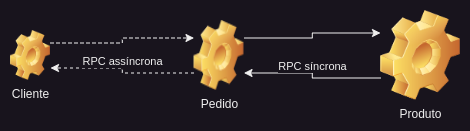
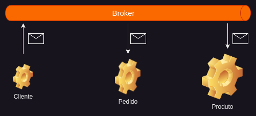
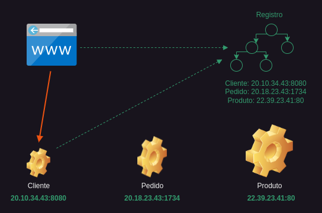
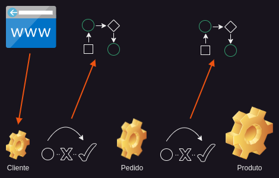
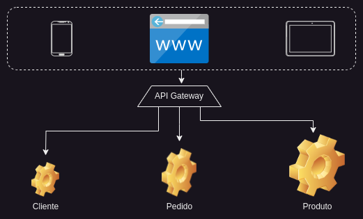

# Microsserviço

Fontes: Microservices: The big picture, Antonio Gonçalves, PluralSight

Conteúdo:

<!-- TOC start (generated with https://github.com/derlin/bitdowntoc) -->

- [Ciclo de vida do desenvolvimento de software](#ciclo-de-vida-do-desenvolvimento-de-software)
- [O que são Microsserviços?](#o-que-são-microsserviços)
- [Terminologia, padrões de Projeto e conceitos](#terminologia-padrões-de-projeto-e-conceitos)
  - [Primeiro uma análise de uma aplicação monolítica](#primeiro-uma-análise-de-uma-aplicação-monolítica)
  - [Construindo uma aplicação em microsserviços](#construindo-uma-aplicação-em-microsserviços)
  - [Organizando a equipe](#organizando-a-equipe)
  - [Armazenamento de dados](#armazenamento-de-dados)
- [User Interface](#user-interface)
- [Comunicação entre microsserviços](#comunicação-entre-microsserviços)
  - [Remote Procedure Call](#remote-procedure-call)
  - [Mensagens](#mensagens)
  - [Formato da mensagem](#formato-da-mensagem)
  - [Como cada equipe sabe como invocar um microsserviço externo?](#como-cada-equipe-sabe-como-invocar-um-microsserviço-externo)
  - [Considerando especificidades dos dispositivos](#considerando-especificidades-dos-dispositivos)
- [Serviços distribuídos](#serviços-distribuídos)
  - [Service registry](#service-registry)
  - [Cross-Origin Resource Sharing, or CORS](#cross-origin-resource-sharing-or-cors)
  - [Circuit breaker](#circuit-breaker)
  - [API gateway](#api-gateway)
- [Segurança](#segurança)
- [Escalabilidade](#escalabilidade)
- [Disponibilidade](#disponibilidade)
- [Monitoramento](#monitoramento)
  - [Monitoramento e Dashboard](#monitoramento-e-dashboard)
  - [health check](#health-check)
  - [Agregação de log](#agregação-de-log)
  - [Exception Traking](#exception-traking)
  - [Metrics](#metrics)
  - [Auditing](#auditing)
  - [Rate Limiting](#rate-limiting)
  - [Alerting](#alerting)
  - [Distributed Tracing](#distributed-tracing)
- [microsserviço Patterns](#microsserviço-patterns)

<!-- TOC end -->

- Comparação entre arquitetura de microsserviço e arquitetura de monólito
- Como o ciclo de desenvolvimento de software pode ser afetado pela escolha entre estas abordagem
- Terminologia e microsserviço
- Conceitos e padrões de design utilizados em microsserviço
- Prós e contras de microsserviço

## Ciclo de vida do desenvolvimento de software

Independente do modelo seguido, o desenvolvimento de software tem um ciclo de vida que faz com que um software chegue até o ambiente de produção. Esse processo envolve pessoas para desenhar, desenvolver, por e executar o software em produção. microsserviço impacta este ciclo de desenvolvimento, seja na tecnologia, na organização da equipe ou na forma em como você roda o seu software em produção.

1. Durante a fase de análise, reunimos os requisitos. Durante os primeiros sprints, esta é a base da aplicação que define os requisitos mínimos para fazer a aplicação decolar.
2. Depois vem a fase de planejamento e design, onde planejamos esse sprint para garantir que podemos atender aos requisitos no cronograma determinado, bem como extrair os elementos de design dos requisitos.
3. A fase de desenvolvimento é a mais longa. É aqui que entramos em ação e desenvolvemos tudo o que foi planejado. Isso anda de mãos dadas com a fase de testes.
4. Ao final deste sprint, liberamos todos os recursos planejados em produção. Agora o produto está vivo e funcionando. É aí que nossos clientes começam a usar nosso aplicativo que agora precisa ser monitorado.
5. Esta é uma fase importante, pois nos dará algum feedback sobre como nossos clientes utilizam o aplicativo. Com base nesses resultados, podemos construir uma lista de requisitos para a próxima iteração.
6. E é claro que no longo prazo teremos que manter o aplicativo.

Durante este ciclo de vida de desenvolvimento, várias pessoas diferentes estão envolvidas:

1. Usuários e analistas de negócios reunirão seus requisitos e anotarão as histórias de usuários para um determinado sprint.
2. Desenvolvedores, web designers e arquitetos projetarão e desenvolverão o software.
3. Os gerentes de projeto coordenarão o projeto e garantirão a sincronização de todos, para que a meta possa ser alcançada.
4. Uma vez em produção, a equipe operacional é responsável por monitorar, lidar com a segurança e garantir que o software esteja funcionando 24/7.

Uma organização normalmente terá vários desses projetos, maiores, menores, execuções cruciais, funcionando 24/7, projetos paralelos executados apenas em determinadas ocasiões. Podem ser relacionados ou não, desenvolvidos em diferentes países por diferentes equipes. Cada projeto é em sua maioria independente, então alguns podem ter usado uma abordagem em cascata, outros ágeis. Alguns projetos podem levar algumas semanas para serem construídos, outros, alguns anos. Alguns terão sucesso e outros falharão. O projeto seguinte se transformará em software. E, finalmente, cada software será implantado. Alguns serão implantados em servidores ou máquinas virtuais, outros serão implantados diretamente na nuvem. Este é um rápido resumo do que a maioria das empresas de TI faz ao construir software. Microsserviços também são softwares e seguem aproximadamente o mesmo ciclo de vida de desenvolvimento, com algumas pequenas alterações.

## O que são Microsserviços?

O termo microsserviços descreve um estilo de desenvolvimento de software que cresceu a partir de tendências recentes para estabelecer práticas destinadas a aumentar a velocidade e a eficiência do desenvolvimento e gerenciamento de soluções de software em escala. Este conjunto de práticas é agnóstico em termos de tecnologia, tata-se mais de aplicar um certo número de princípios e padrões arquitetônicos que finalmente criarão uma arquitetura de microsserviços.

É importante entender que:

- Cada microsserviço deve fazer uma coisa e fazê-lo bem. Portanto, o micro refere-se ao escopo da funcionalidade do serviço.
- Um microsserviço é um serviço construído em torno de um recurso de negócios específico, **que pode ser implantado de forma independente**. Chamamos isso de contexto delimitado.
- Os microsserviços são desenvolvidos e implantados de forma independente. Cada microsserviço é implantado à sua maneira e em seu próprio ritmo. E como os microsserviços precisam interagir entre si, eles trocam mensagens entre eles.
- Portanto, para construir um aplicativo corporativo de grande porte, precisamos identificar os subdomínios do nosso domínio comercial principal e construir cada subdomínio como um microsserviço. Por exemplo, um aplicativo de comércio eletrônico tem um domínio grande, mas pensando bem, você pode dividi-lo em vários subdomínios menores, como gerenciamento de usuários, catálogo, faturamento e assim por diante.

Um serviço é um componente de código limitado implementável de forma independente que oferece suporte à interoperabilidade por meio de comunicação baseada em mensagens. James Lewis e Martin Fowler, ambos da Thoughtworks, foram quem cunharam o termo microsserviço. A definição original que eles deram diz: o estilo arquitetural de microsserviços é uma abordagem para desenvolver um único aplicativo como um conjunto de pequenos serviços, cada um executando seu próprio processo e se comunicando com mecanismos leves. Por mecanismos leves, eles queriam dizer recursos HTTP. Esses serviços são construídos em torno de capacidades de negócios, o famoso contexto delimitado, e podem ser implantados de forma independente.

Sam Newman, também da Thoughtworks, tem uma definição mais concisa, microsserviços são serviços pequenos e autônomos que funcionam juntos. Esta citação enfatiza o nível de independência, o escopo delimitado e a decomposição de uma aplicação em serviços altamente coesos e pouco acoplados.

A maneira como desenvolvemos software é basicamente um projeto que resulta em um produto, um aplicativo, que é um software. Quanto maior o projeto, maior será o seu ciclo de vida. Pode levar alguns meses ou anos para reunir os requisitos e realmente lançá-lo em produção. Quanto maior o projeto, maiores serão as equipes, pois você precisa de mais pessoas para projetar, mais pessoas para desenvolver e mais pessoas para testar. Vamos chamar esse grande software de monólito por enquanto. Agora, se você conseguir dividir esse monólito em microsserviços menores, poderá se concentrar em algo menor. O ciclo de vida de desenvolvimento ainda é o mesmo, com as mesmas fases diferentes pelas quais deve passar. Mas um projeto menor itera mais rápido desde os requisitos até o desenvolvimento e a liberação para produção. Isso é bom para o tempo de lançamento no mercado. Um projeto menor também significa uma equipe menor. Na verdade, em vez de ter várias equipes localizadas em escritórios diferentes, cada uma trabalhando em sua tarefa e não se comunicando muito com as outras equipes, você pode ter uma única trabalhando em estreita colaboração.

Os microsserviços vão obrigar você a ser mais ágil, aos demais usuários, aos desenvolvedores, à equipe operacional, à equipe de QA, todos juntos trabalhando no mesmo produto. Mas é claro, se você subdividiu um aplicativo em partes menores, isso significa que você acabará com vários projetos vivendo em paralelo. Por serem pequenos, todos se beneficiarão por terem equipes pequenas, ciclo de vida de desenvolvimento mais rápido e chegarem à produção no prazo. Cada microsserviço vive de forma independente, mas todos dependem uns dos outros. Ser pequeno em termos de funcionalidades de negócio significa que você precisa interagir com outros microsserviços, para que todos juntos possam realizar as tarefas da sua aplicação. Todos eles são implantados em produção em seu próprio ritmo, on-premise, na nuvem, convivendo lado a lado com outros microsserviços.

## Terminologia, padrões de Projeto e conceitos

### Primeiro uma análise de uma aplicação monolítica

Monólitos tem vários benefícios:

- Eles são simples de desenvolver, a stack técnica é limitada a alguns frameworks, linguagens e bancos de dados.
- O código pode caber em um único IDE e pode ser facilmente construído.
- Eles são simples de testar, é claro que você ainda precisa simular alguns serviços externos ao fazer testes de integração, mas a maioria dos seus testes testa um único software.
- Os monólitos também são simples de implantar. Você simplesmente  implanta os artefatos finais com os runtime apropriados, configura algumas propriedades e pronto.
- Eles também são simples de escalar: basta executar várias instâncias do mesmo aplicativo por trás de um load balancer.

Quando o aplicativo se torna grande e as equipes aumentam de tamanho, a abordagem monolítica apresenta diversas desvantagens:

- Quanto maior for o aplicativo, mais difícil será para um novo membro da equipe se tornar produtivo. E você precisará de algumas equipes extras para lidar com o tamanho de um monólito em crescimento. Quando a aplicação atingir um determinado tamanho, será necessário dividir a organização em equipes que se concentrem em áreas funcionais específicas. Por exemplo, uma equipe apenas desenvolvendo a UI, outra para o backend, outra para testes, para implantação. O problema de um aplicativo monolítico é que ele impede que as equipes trabalhem de forma independente. As equipes devem ser coordenadas.
- Com grandes monólitos o código do aplicativo ficará mais difícil de entender e modificar. Como resultado, o desenvolvimento normalmente fica mais lento, seguido pela qualidade do código. Você não conseguirá tirar vantagem facilmente das tecnologias emergentes, mas sim apostar em um compromisso de longo prazo com a tecnologia atual.
- E se uma pequena parte do aplicativo precisar de um banco de dados diferente? Você precisará alterar muito código apenas para isso.
- Você acabará escalando o aplicativo pelos motivos errados. Se precisar de mais CPU para lidar com todas as faturas, digamos para as vendas de Natal, você precisará dimensionar toda a aplicação, não apenas as faturas.
- Quanto maior o aplicativo, mais tempo o contêiner que hospeda o aplicativo levará para inicializar e mais recursos ele consumirá.
- O banco de dados contém todos os dados e pode ficar enorme, o que terá impacto no desempenho da aplicação.

### Construindo uma aplicação em microsserviços

Vamos começar nossa jornada com a construção de um aplicativo de comércio eletrônico no modo microsserviço. Sendo a jornada longa, vamos começar pelo início, a fase de design. Precisamos definir uma arquitetura que estruture a aplicação como um conjunto de serviços colaborativos fracamente acoplados. Para isso, podemos definir serviços correspondentes a subdomínios de design orientado a domínio. Um domínio aqui em nosso aplicativo de comércio eletrônico consiste em vários subdomínios.

Cada subdomínio corresponde a uma parte diferente do negócio. Portanto, se olharmos atentamente para o nosso modelo de domínio, notamos que podemos subdividir em três subdomínios. O subdomínio do usuário trata da autenticação do usuário, seu perfil, seu endereço. Aí podemos ver que há uma parte processando pedidos de compra, faturas, taxas e descontos. Por fim, temos um subdomínio inteiro relacionado aos produtos e aos fornecedores que os vendem.

Para mantermos os novos microsserviços enquadrados nas definições que foram apresentadas mais a cima, estes subdomínios, agora transformados em microsserviços deveriam ser totalmente independentes.

O design orientado a domínio nos fornece um conjunto de técnicas e padrões para nos ajudar a projetar nosso modelo. Uma técnica é duplicar as entidades que dependem umas das outras. Por exemplo, aqui duplicamos o usuário. Sendo entidades separadas, podemos até especializá-las. No domínio do usuário, o usuário pode ter um perfil nas redes sociais, e no domínio do pedido, o usuário pode ter informações sobre pagamento, como cartão de crédito. O mesmo para o produto duplicado em ambos os domínios. Sendo cada subdomínio responsável pelo seu próprio processamento e dados, deverá ter a sua própria base de dados. Na verdade, o compartilhamento de bancos de dados é desencorajado e é um anti-padrão no mundo dos microsserviços.

### Organizando a equipe

Os microsserviços também têm impacto na maneira como você organiza suas equipes e seu código:

- O primeiro impacto é que você passa de uma equipe por domínio para uma equipe por subdomínio. Além disso, desde a fase de design, fica claro que o subdomínio do usuário cobre menos funcionalidades do que o subdomínio do pedido. Isso significa que você pode dimensionar corretamente cada equipe. A equipe menor para o usuário, a equipe maior para o produto e um pouco maior para o subdomínio do pedido que cobre muitas funcionalidades de negócios.
- Cada equipe agora é totalmente independente, ao mesmo tempo em que é a única responsável por todo o ciclo de vida do produto, desde o desenvolvimento até a implantação. É aí que você precisa abraçar as metodologias Agile e Devops, para que cada um com suas habilidades diferentes aprenda a trabalhar junto no mesmo produto. Mesmo que as equipes sejam todas independentes, lembre-se que esses microsserviços acabam se comunicando entre si. Isso significa que você ainda terá que gerenciar e orquestrar a integração entre as equipes em um determinado momento.
- Sendo cada equipe independente e separada, cada uma pode ter o código e a documentação em repositórios separados. Isso como está usando diferentes softwares de controle de versão, como Git, Subversion ou Mercurial. Lembre-se que cada software é independente, portanto o versionamento é importante. Por exemplo, a equipe do pedido de compra pode estar desenvolvendo a versão 1.2 do microsserviço, enquanto a equipe do produto testará a versão 4.8 do microsserviço.

### Armazenamento de dados

Em uma arquitetura de microsserviços, a maioria dos serviços precisa persistir os dados em algum tipo de banco de dados. Os serviços devem ser fracamente acoplados, para que possam ser desenvolvidos, implantados e dimensionados de forma independente. Portanto, cada um precisa do seu próprio armazenamento de dados independente. Na verdade, isso faz sentido. Diferentes serviços têm diferentes requisitos de armazenamento de dados. Um dependerá fortemente de transações, um outro terá mais escrita e outro somente leitura. Na verdade, para alguns serviços, um banco de dados relacional seria a melhor escolha, por exemplo, para o nosso microsserviço de produto. Outros serviços podem precisar de um banco de dados NoSQL, como um banco de dados de documentos, que é bom para armazenar dados não estruturados. Nosso microsserviço de usuário pode usar um diretório LDAP. Usar um banco de dados por serviço garante que os serviços sejam fracamente acoplados. As alterações no banco de dados de um serviço não afetam nenhum outro serviço.

Ter bancos de dados separados traz outro desafio: a sincronização de dados. Se um cliente alterar um endereço de e-mail no subdomínio do usuário, a alteração deverá ser replicada no subdomínio do pedido. O mesmo para o produto. No mundo dos microsserviços, não existem transações distribuídas. Isso significa que quando você atualiza o subdomínio do usuário, não é possível abranger uma transação distribuída do tipo Two-phase commit de longa duração para o subdomínio do pedido. Isso teria um impacto no desempenho do seu aplicativo. Sem essa transação distribuída, você perde a consistência imediata dos seus dados. Você então terá que passar para um modelo de consistência eventual. Isso significa que um serviço publica um evento quando seus dados são alterados. Os outros serviços consomem esse evento e atualizam esses dados. Isso está relacionado ao padrões *Change Data Capture (CDC)* e *event-sourcing*. Isso significa que, por um período de tempo, o mesmo produto pode ter um preço ou descrição diferente em ambos os subdomínios. Existem várias maneiras de publicar um evento, incluindo ferramentas como Akka, Kafka ou RabbitMQ. Uma ferramenta como o Debezium usa eventos para lidar com *Change Data Capture (CDC)*.

## User Interface

Nem todos os microsserviços possuem uma interface de usuário, mas quando possuem, existem diversas técnicas que podemos usar se precisarmos agregá-los.

Um benefício dos microsserviços é que cada equipe se desenvolve de maneira relativamente isolada e independente. Eles podem desenvolver e manter seu próprio conjunto de componentes gráficos, agregá-los, trabalhar com designers para gerar a melhor experiência de usuário para seus casos de uso. Mas surge rapidamente um desafio: como implementar uma interface de usuário exclusiva que exiba dados de vários microsserviços, fazendo com que nossos usuários sintam que estão interagindo com um único aplicativo?

Existem dois padrões de design que podemos usar: (1) [Composição de página do lado do servidor](./sdui/index.html), permite construir páginas da web no servidor compondo fragmentos HTML desenvolvidos por várias equipes de microsserviços. (2) Composição do lado do cliente, onde o navegador constrói uma única interface UI compondo fragmentos de UI. Isso significa que precisamos de uma equipe de UI responsável por implementar o esqueleto do aplicativo que agrega vários componentes de UI de microsserviços.

Esta composição tem que ser responsiva, levando em consideração todos os diferentes dispositivos.

## Comunicação entre microsserviços

Uma vez que nosso subdomínio é isolado, seu pacote é implantado e executado independentemente um do outro. Esses microsserviços podem ser mais ou menos complexos, podem armazenar dados ou não, ter interface de usuário ou não, mas a maioria deles acabará se comunicando entre si. Quando o fazem, precisam expor e consumir APIs, usar um protocolo de comunicação e escolher um estilo de comunicação. Vamos nos concentrar nas duas principais famílias de comunicação: invocação de procedimento remoto (RPC) e mensagens.

### Remote Procedure Call

A Invocação de Procedimento Remoto, também conhecida como Chamada de Procedimento Remoto, é o protocolo de comunicação entre processos mais simples e familiar. Funciona com base no princípio de request/response. Um serviço solicita algo a outro serviço e este responde. Por exemplo, nosso microsserviço de pedido de compra solicita que o microsserviço do produto obtenha o preço de um produto específico. Essa chamada pode ser síncrona, o que significa que o chamador aguardará até que a solicitação retorne, ou assíncrona, por exemplo, o microsserviço do usuário invoca o microsserviço do pedido para obter uma cópia de um pedido de compra específico por e-mail. Isso pode ser feito de forma assíncrona. O microsserviço do pedido enviará de volta uma notificação assim que o e-mail for enviado. Existem numerosos exemplos de tecnologias RPI, como REST, SOAP ou gRPC.

### Mensagens

Nesse formato os microsserviços trocam mensagens ou eventos por meio de um *broker* ou canal. Funciona da seguinte forma: quando um microsserviço deseja interagir com outro, ele publica uma mensagem no *broker*. Os outros microsserviços se inscrevem nesse *broker* se estiverem interessados em tais mensagens e recebem as mensagens posteriormente. Esses microsserviços podem então atualizar seu próprio estado. As mensagens assíncronas desempenham um papel significativo em manter as coisas fracamente acopladas em uma arquitetura de microsserviços. Eles também melhoram a disponibilidade, pois o *broker* de mensagens armazena as mensagens em buffer até que o consumidor seja capaz de processá-las. Existem numerosos exemplos de *broker* de mensagens, como Apache Kafka ou Rabbit MQ.

### Formato da mensagem

Não importa se usamos mensagens ou RPC, precisamos definir o formato das trocas de microsserviços de dados. Dependendo das necessidades da sua arquitetura, você pode usar texto ou binário. As mensagens de texto podem assumir diversos formatos, mesmo que os mais utilizados atualmente sejam XML, JSON ou YAML. A principal vantagem é que eles são legíveis por humanos, fáceis de implementar e fáceis de depurar. Você também pode trocar mensagens binárias. Protocolos binários como o gRPC, por exemplo, são mais compactos, porém mais difíceis de manusear.

### Como cada equipe sabe como invocar um microsserviço externo?

Através de APIs e contratos. Uma API, ou interface de programa de aplicativo, é um conjunto de rotinas, estrutura de dados e protocolos expostos pelo microsserviço. Digamos que nosso microsserviço de pedido exponha duas APIs, uma para criar um novo pedido de compra e outra para recuperar um pedido existente. Para que os outros serviços saibam o que está exposto e como invocá-lo, o microsserviço order expõe um contrato. Dessa forma, o microsserviço do usuário obtém o contrato, lê-o e descobre como invocar uma API remota para criar um pedido de compra. Dependendo se você usa SOAP, REST ou gRPC, você terá que descrever sua API de microsserviços usando WSDL, Swagger ou Interface Definition Language.

### Considerando especificidades dos dispositivos

Como a maioria das aplicações atuais, precisamos estar cientes da multiplicidade de dispositivos, bem como das restrições da rede. Se um laptop conectado a uma boa rede de fibra óptica precisar recuperar um pedido de compra específico, talvez queiramos fornecer todos os detalhes, incluindo uma representação em PDF, mas se a mesma chamada de API acontecer a partir de um dispositivo móvel preso no transporte público com problemas conexão com a Internet, podemos querer mostrar apenas um subconjunto de informações. Como você pode ver, cada dispositivo tem necessidades diferentes, portanto devemos ter APIs e contratos diferentes por dispositivo. Esta é uma prática comum que também tem sido aplicada à arquitetura de microsserviços.

## Serviços distribuídos

### Service registry

Quando temos microsserviços conversando entre si por meio de uma rede, precisamos implementar alguns padrões extras para garantir que o sistema seja confiável. Um aplicativo baseado em microsserviço normalmente é executado em um ambiente onde o número de instâncias de serviço e sua localização de rede mudam dinamicamente. Então, como o cliente de um microsserviço descobre sua localização se ela muda constantemente? A resposta é usar um **registro de serviço**.

Um **registro de serviço** é uma lista telefônica de serviços com suas localizações, permitindo que os clientes procurem serviços por seus nomes lógicos. A primeira coisa que nossos microsserviços precisam fazer é o autorregistro. Isso significa que eles precisam registrar o local da rede na inicialização e, posteriormente, cancelar o registro no desligamento. Ao fazer uma solicitação a um serviço, o cliente precisa primeiro descobrir a localização de uma instância de serviço consultando o registro. E então pode invocar o microsserviço necessário. Registros de serviços famosos são Eureka, Zookeeper ou Consul, por exemplo.

### Cross-Origin Resource Sharing, or CORS

Ao lidar com microsserviços localizados em servidores diferentes, precisamos rapidamente lidar com o Cross-Origin Resource Sharing, ou CORS. No HTTP, a política de mesma origem é muito restritiva. De acordo com esta política, um documento hospedado no microsserviço do usuário só pode interagir com outros documentos que também estejam nesse mesmo servidor. Em suma, a política de mesma origem impõe que os documentos que interagem entre si tenham a mesma origem. Uma origem é composta pelo protocolo, HTTP ou HTTPS, o host e o número da porta. Mas em uma arquitetura de microsserviços, os serviços estão localizados em origens diferentes e precisam se comunicar entre si, ou seja, atravessando a origem.

Por motivos de segurança, os navegadores restringem solicitações HTTP de origem cruzada iniciadas em scripts. Para permitir o compartilhamento de recursos entre origens, os microsserviços precisam usar cabeçalhos HTTP adicionais para permitir que um agente do usuário obtenha permissão para acessar recursos selecionados de um servidor em uma origem diferente. Isso normalmente lida com a família de cabeçalhos HTTP access-control-allow-origin. Mas o CORS não é a única coisa que pode reter uma chamada entre dois microsserviços.

### Circuit breaker

Com a Invocação de Procedimento Remoto, os serviços precisam estar disponíveis, pois não há intermediários, como quando utilizando mensagens. Quando nosso microsserviço de usuário invoca o pedido de compra de forma síncrona, sempre existe a possibilidade de o pedido de compra estar indisponível. Isso pode ocorrer devido a uma falha na rede ou porque o pedido de compra está sob carga pesada e é essencialmente inutilizável.

A falha do microsserviço do pedido de compra pode potencialmente se espalhar para o microsserviço do usuário e, em seguida, para todo o aplicativo. Chamamos isso de efeito dominó. Uma falha em um sistema pode fazer com que outros sistemas falhem. Para evitar isso, precisamos introduzir um circuit breaker (disjuntor). Um circuit breaker é uma forma de invocar um serviço remoto por meio de um proxy para desviar a chamada, se necessário. Por exemplo, se o número de falhas consecutivas ultrapassar um determinado limite, o circuit breaker deixará de tentar invocar o serviço remoto e desviará as chamadas. Depois que o tempo limite expirar, o circuit breaker começará a permitir a passagem de um número limitado de solicitações. Se essas solicitações forem bem-sucedidas, o circuit breaker retoma a operação normal. O circuit breaker tenta lentamente reintroduzir o tráfego. Já existem alguns circuit breakers por aí, como Hystrix ou JRugged.

### API gateway

Vamos retomar nossas interfaces de usuário. Cada microsserviço possui seu próprio conjunto de componentes gráficos, mas no final das contas, eles devem ser agregados em um único aplicativo.

Como esses componentes acessam os serviços individuais? Uma solução é ter um relacionamento 1:1 entre o componente e o microsserviço, mas cada chamada precisa lidar com questões transversais, como segurança.

Uma abordagem melhor é ter um API Gateway, que é o ponto de entrada único para todos os clientes. Isso permite que cada cliente tenha uma interface unificada para todos os microsserviços. O gateway pode então tratar solicitações de duas maneiras. Algumas solicitações são simplesmente roteadas para o serviço apropriado, outras podem lidar com questões transversais, como autenticação, autorização ou determinação da localização dos serviços por meio do registro.

Um gateway também pode ser o local ideal para inserir a tradução da API. Dispositivos diferentes precisam de dados diferentes, portanto o gateway pode expor uma API diferente para cada cliente. Existem alguns gateways que podem ser usados imediatamente em uma arquitetura de microsserviço, como Zuul, Netty ou Finagle.

## Segurança

Autenticação e autorização são os termos usados para controlar o acesso a um serviço e aplicar políticas. Autenticação é o processo de afirmar que alguém realmente é quem afirma ser. Por exemplo, pedindo um usuário e senha. Autorização refere-se a regras que determinam quem tem permissão para fazer o quê. Por exemplo, apenas administradores podem remover usuários existentes do nosso microsserviço de usuário. Para isso, utilizamos um sistema de gerenciamento de identidade e acesso. Ele aborda a necessidade de garantir o acesso adequado aos recursos em todo o nosso sistema distribuído. Isso significa que nossos microsserviços não precisam lidar com formulários de registro, autenticação de usuários ou armazenamento de credenciais. Eles delegam autenticação e autorização ao sistema de gerenciamento de identidade e acesso. Por exemplo, um usuário tenta se autenticar, com a credencial errada, não terá permissão para acessar o microsserviço do usuário. Se as credenciais estiverem corretas, a chamada poderá ser feita para o serviço. Com o logon único, uma vez logados, os usuários não precisam fazer login novamente para acessar um microsserviço diferente. É aqui que você pode encontrar protocolos de autenticação como Kerberos, OpenID Connect, OAuth 2.0 ou SAML.

Aqui você pode ver a vantagem de ter um gateway como ponto de entrada único para solicitações de clientes. Ele autentica solicitações e as encaminha para outros serviços, que por sua vez podem invocar outros serviços. Alguns sistemas de gerenciamento de identidade e acesso bem conhecidos são Okta, Keycloak ou Shiro.

Num sistema distribuído, é fundamental afirmar a autenticidade das solicitações de forma consistente em todos os serviços. Em outras palavras, uma vez autenticado, como um microsserviço comunica a identidade do solicitante aos outros microsserviços? A resposta é através de tokens de acesso. Um token de acesso armazena com segurança informações sobre um usuário e é então trocado entre serviços. Cada serviço precisa ter certeza de que o token é válido e retirar dele as informações do usuário para verificar se o usuário está autorizado a realizar a operação ou não. Os tokens podem seguir a especificação JSON Web Token.

Outra possibilidade é utilizar cookies entre chamadas de serviço. Você pode ver novamente o benefício do gateway, pois ele centraliza as chamadas da interface do usuário e o controle do token de acesso.

## Escalabilidade

Uma grande vantagem de uma arquitetura de microsserviços é que você pode dimensionar cada microsserviço de forma independente, dependendo de suas necessidades. Mas para ser distribuído, o sistema também tem que estar disponível e, para isso, existem algumas técnicas que você deve conhecer. No Natal, nosso aplicativo certamente ficará sobrecarregado, pois os clientes comprarão mais produtos. Nosso microsserviço de usuário pode não ser muito afetado por isso, mas definitivamente precisaremos dimensionar nossos pedidos de compra e microsserviços de produtos.

Na verdade, existem várias maneiras de fazer isso. A escala vertical significa que você escala adicionando mais potência a uma máquina existente. Por exemplo, a máquina para nosso microsserviço de pedido de compra obtém mais CPU e RAM e funciona bem para esse microsserviço específico. Já o dimensionamento horizontal significa que você dimensiona adicionando mais máquinas. Assim, nosso microsserviço de produto é replicado em máquinas diferentes.

Falamos sobre replicação de serviços ou clustering. Os serviços podem aumentar ou diminuir com base em determinadas métricas predefinidas. Quando escalamos horizontalmente, obtemos diversas instâncias do mesmo microsserviço localizadas em servidores diferentes. Quando o pedido de compra invocar o produto, qual das três instâncias ele utilizará? Lembre-se que temos um serviço de registro, então todas as instâncias do produto ficam cadastradas nele. Então é só uma questão de ter um balanceamento de carga do cliente no pedido de compra.

O balanceador de carga será selecionado entre as instâncias registradas do microsserviço do produto. Então aqui as três instâncias são descobertas. Em seguida, o balanceador de carga escolhe entre as instâncias candidatas para qual encaminhar a solicitação. O balanceador de carga decide com base nos critérios que desejar, round-robin, ou com base no peso e na capacidade do serviço. Ribbon ou Meraki são ferramentas comuns de balanceamento de carga de cliente.

## Disponibilidade

Disponibilidade significa a probabilidade de um sistema estar operacional em um determinado momento. Os sistemas disponíveis relatam a disponibilidade em termos de minutos ou horas de inatividade por ano. Por exemplo, espera-se que um sistema com alta disponibilidade esteja disponível 99,999% do tempo. Em nossa arquitetura, temos alguns pontos únicos de falha, também chamados de SPOF. Um ponto único de falha é uma parte de um sistema que, se falhar, impedirá o funcionamento de todo o sistema. Por exemplo, temos apenas um gateway, um agente de mensagens, um registro de serviço e um sistema de gerenciamento de identidade e acesso. Para que um sistema distribuído esteja continuamente disponível, cada solicitação recebida por um nó que não cai no sistema deve resultar em uma resposta. Isso significa que se o registro do serviço estiver inativo, o microsserviço do usuário não conseguirá localizar os microsserviços do pedido de compra e todo o sistema ficará indisponível. Para corrigir isso, **todos os pontos únicos de falha precisam ser dimensionados horizontalmente**, portanto, temos várias instâncias. Eles também precisam ser agrupados em um cluster para que possam se manter sincronizados.

## Monitoramento

### Monitoramento e Dashboard

Um dos aspectos mais importantes de um sistema distribuído é o monitoramento. Isto permite-lhe tomar medidas proativas se, por exemplo, um serviço estiver a consumir recursos inesperados ou não responder. Há tantas partes móveis e tantas máquinas envolvidas em uma arquitetura de microsserviços que você precisa monitorar rapidamente o que está acontecendo. Você precisa visualizar rapidamente as instâncias em execução, vendo suas taxas de falha e sucesso e identificando o Botão x. Uma característica fundamental do monitoramento é que ele deve ser centralizado. Imagine ter que fazer login em cada máquina, verificar os logs ou o processo manualmente. Isso não é possível quando você tem dezenas, centenas e, às vezes, milhares de dispositivos para monitorar. E quando a arquitetura é muito complexa, a informação precisa ser visual. As ferramentas de monitoramento precisam de um painel onde você possa visualizar rapidamente o que está errado. Painéis de monitoramento como Kibana, Grafana ou Splunk permitem visualizar todos os tipos de informações.

### health check

Uma informação muito importante é o exame de saúde. Às vezes, uma instância de microsserviço pode estar em execução, mas ser incapaz de lidar com solicitações. Por exemplo, pode ter ficado sem conexões com o banco de dados. Como detectar que um microsserviço em execução não consegue lidar com solicitações? Uma maneira é ter uma API de verificação de integridade em cada microsserviço, que é um endpoint HTTP que retorna a integridade do serviço e pode receber ping pelo monitoramento centralizado. A API de verificação de integridade realiza várias verificações, como status do banco de dados, status do host, espaço em disco, memória disponível e assim por diante. O monitoramento centralizado invoca periodicamente esses endpoints para verificar a integridade de cada serviço e, portanto, a integridade de todo o sistema. Pense nisso como batimentos cardíacos.

### Agregação de log

Nosso aplicativo consiste em vários microsserviços executados em várias máquinas. Graças à verificação de integridade, sabemos que eles estão vivos, mas como podemos entender o comportamento do aplicativo e solucionar problemas? Bem, cada microsserviço grava informações sobre o que está fazendo em um arquivo de log em um formato padronizado. O arquivo de log contém erros, avisos, informações e mensagens de depuração. Mas como não é eficiente ler cada arquivo de log de cada microsserviço para entender o que está acontecendo, usamos um agregador de log. É um serviço de log centralizado que agrega log de cada instância de serviço. Os administradores podem então pesquisar e analisar os logs dos painéis. Existem alguns agregadores de log que você pode escolher, como LogStash, Splunk ou PaperTrail.

### Exception Traking

Às vezes ocorrem erros ao encerrar solicitações. Quando ocorre um erro, um microsserviço lança uma exceção, que contém uma mensagem de erro e um rastreamento de pilha. Esta exceção aparece no meio do arquivo de log com todos os tipos de informações e pode ser difícil de encontrar. É por isso que as exceções devem ser registradas em um sistema centralizado de rastreamento de exceções, para que possam ser investigadas e resolvidas pelos desenvolvedores. Isso é crucial para compreender os erros do nosso sistema, corrigi-los e, esperançosamente, ver a evolução dos erros diminuindo ao longo do tempo.

### Metrics

Temos verificações de integridade, registros, mas como sabemos que o sistema está ficando lento ou como detectamos problemas de desempenho? Precisamos instrumentar nossos microsserviços para coletar estatísticas sobre operações individuais. Quanto tempo leva para responder uma solicitação HTTP, quanto tempo leva para criar um pedido de compra, quanto tempo leva para acessar o banco de dados? Temos então que agregar essas métricas em um serviço de métricas centralizado, que fornece relatórios e alertas. Existem várias ferramentas que você pode usar, como DropWizard, Spring Actuator ou Prometheus.

### Auditing

Em uma arquitetura de microsserviços, é importante compreender o comportamento dos usuários. É útil saber quais ações um usuário executou recentemente, logins e logouts bem-sucedidos, qual microsserviço foi solicitado para essa interação específica do usuário, quais páginas foram visitadas, quantos produtos foram navegados, quantos produtos foram comprados? A atividade do usuário deve ser registrada em um sistema centralizado, para que possamos entender melhor as partes do nosso sistema que são muito utilizadas pelos nossos usuários e, portanto, otimizá-las ou escaloná-las, se necessário.

### Rate Limiting

Mas não são apenas os usuários que podem acessar seus microsserviços. Todos os microsservidores podem, e às vezes podem ser microsserviços de terceiros que invocam suas APIs. É por isso que você deve controlar o uso da API configurando a limitação de taxa. A limitação de taxa não é nova e não está apenas relacionada a microsserviços. Na verdade, o principal motivo para implementar a limitação de taxa foi defender as aplicações contra ataques DoS e negação de serviço. Foi uma forma de aplicar políticas para limitar o tráfego proveniente de fontes específicas, clientes específicos, endereços de API e assim por diante. Hoje em dia, com microsserviços e APIs expostas, a limitação de taxa tornou-se uma forma de gerenciar nossas APIs. Podemos limitar a taxa de quantas solicitações HTTP um cliente pode fazer em um determinado período de tempo. É também uma forma de monetizar nossas APIs. Por exemplo, um cliente específico tem o direito de acessar a API do nosso produto apenas 100 vezes por dia. Se o cliente quiser mais acessos, deverá pagar mais por isso.

### Alerting

Agora que temos toneladas de informações sobre a integridade do sistema, exceções, métricas, auditorias, como ser proativo e corrigir um problema quando ele ocorre, os administradores não podem passar o dia olhando para o sistema de monitoramento centralizado. Em vez disso, eles precisam configurar alertas que são acionados quando determinadas mensagens aparecem nos logs, para que possam esquecer informações não relevantes. Portanto, quando um determinado limite for atingido, o sistema de monitoramento deverá gerar um alerta.

### Distributed Tracing

Agora, com todo o monitoramento e alertas, poderíamos pensar que terminamos, mas há algo específico dos sistemas distribuídos que deve ser levado em consideração, o rastreamento distribuído. As solicitações geralmente abrangem vários serviços, por exemplo, um usuário acessa o microsserviço do usuário, faz login, cria um carrinho de compras, seleciona alguns produtos do banco de dados e gera um pedido de compra. Até agora, registramos cada evento separadamente e podemos rastrear toda a solicitação, desde a interface do usuário até o banco de dados, por meio de três microsserviços. Com o rastreamento distribuído, instrumentamos os serviços com código que atribui a cada solicitação um identificador de correlação exclusivo que é então passado entre os serviços. Isso cria uma cadeia de chamadas. Ele fornece insights úteis, por exemplo, todo o tempo de resposta de uma invocação inteira e as fontes de latência. Já os logs e as métricas nos fornecem insights de uma operação individual. Existem alguns sistemas de rastreamento que você pode usar em sua arquitetura de microsserviços, como Dapper, HTrace ou Zipkin.

## microsserviço Patterns

Sugestões de curso:

Microservice Architecture by Rag Dhiman

Modern Software Architecture by Dino Esposito
