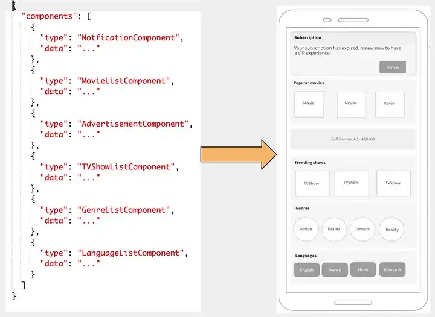

# Server Driven UI (SDUI)

Fonte: [Eduardo Haag](https://www.dio.me/articles/explorando-o-conceito-revolucionario-da-server-driven-ui)

No dinâmico mundo do desenvolvimento de interfaces de usuário, uma abordagem inovadora vem ganhando destaque: a Server Driven UI. Essa abordagem está revolucionando a maneira como criamos e entregamos experiências de usuário em aplicativos. Neste artigo tentei trazer um pouco do conceito da Server Driven UI, entender como ele funciona e explorar seus benefícios para o desenvolvimento de software.

## O Que é Server Driven UI (SDUI)?

A Server Driven UI é uma abordagem em que a estrutura e o conteúdo da interface do usuário são controlados pelo servidor, em vez de estar embutidos no código do aplicativo. Isso significa que em vez de criar e atualizar telas no lado do cliente, as instruções para a construção da interface são enviadas do servidor para o aplicativo. Essencialmente, a lógica da interface é transferida do cliente para o servidor.

## omo Funciona?

No coração da SDUI estão os componentes visuais, que são definidos no servidor. O cliente solicita esses componentes ao servidor, que responde com a estrutura da interface, os dados associados e a lógica de apresentação. Isso permite uma personalização dinâmica da interface, onde o servidor pode adaptar a experiência do usuário com base em diversos fatores, como perfil do usuário, contexto ou até mesmo mudanças em tempo real.

## Benefícios da Server Driven UI

* Flexibilidade e Iteração Rápida: Com a lógica da interface sendo controlada remotamente, as atualizações podem ser feitas no servidor, sem a necessidade de atualizar o aplicativo do cliente. Isso acelera o processo de implementação e permite a iteração rápida, facilitando a adaptação às mudanças de requisitos ou correções de bugs;
* Experiências Altamente Personalizadas: A SDUI possibilita personalizar a interface com base em informações específicas do usuário. Isso permite criar experiências sob medida, aumentando o engajamento e a satisfação do usuário;
* Redução de Tamanho do Aplicativo: Como a lógica da interface é fornecida pelo servidor, o tamanho do aplicativo do cliente pode ser reduzido, uma vez que a maior parte da lógica de apresentação reside no servidor remoto;
* Experimentação e Testes A/B Simplificados: A SDUI torna mais fácil realizar experimentos e testes A/B, permitindo testar diferentes interfaces e fluxos sem a necessidade de atualizar o aplicativo;
* Gerenciamento Centralizado: Com SDUI, as alterações na interface podem ser implementadas centralmente no servidor, o que simplifica o controle de versões e reduz os riscos de erros nos aplicativos do cliente.

A Server Driven UI está redefinindo a forma como projetamos e entregamos interfaces de usuário em aplicativos. Sua abordagem flexível, personalizada e ágil oferece uma série de benefícios para os desenvolvedores e usuários. Ao transferir parte da lógica de interface para o servidor, a SDUI capacita as equipes de desenvolvimento a criar experiências mais dinâmicas e adaptáveis. À medida que a tecnologia continua a evoluir, essa abordagem promete desempenhar um papel cada vez mais importante na forma como concebemos e implementamos interfaces de usuário inovadoras.
