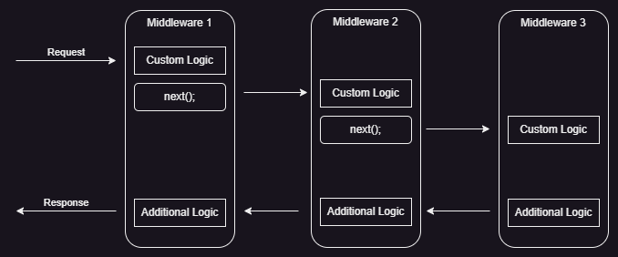
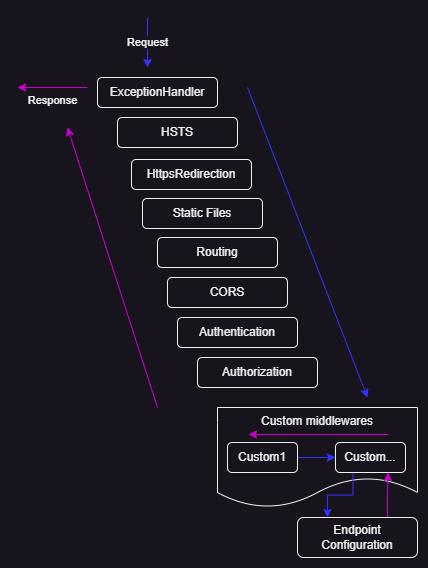

# Dúvidas frequentes em projetos ASP.NET Core

Conteúdo:

<!-- TOC start (generated with https://github.com/derlin/bitdowntoc) -->

- [@model e @Model na view](#model-e-model-na-view)
- [O que é e como usar ASP.NET Core Middlewares](#o-que-é-e-como-usar-aspnet-core-middlewares)

<!-- TOC end -->

## @model e @Model na view

É sempre uma dúvida a questão de onde usar o @model e onde usar o @Model em uma view.
O tipo do modelo de visualização é especificado usando a expressão @model, com m minúsculo. O valor do modelo de visualização é incluído na saída HTML usando a expressão @Model, com M maiúsculo.

Veja no exemplo a seguir na controller:

```csharp
using Microsoft.AspNetCore.Mvc;
namespace FirstProject.Controllers {
  public class HomeController : Controller {
    public ViewResult Index() {
    int hour = DateTime.Now.Hour;
    string viewModel =
    hour < 12 ? "Good Morning" : "Good Afternoon";
    return View("MyView", viewModel);
    }
  }
}
```

A string `viewModel` será passada como model para view *MyView*.

A view:

```html
@model string
@{
  Layout = null;
}
<!DOCTYPE html>
<html>
  <head>
    <meta name="viewport" content="width=device-width" />
    <title>Index</title>
  </head>
  <body>
    <div>
      @Model World (from the view)
    </div>
  </body>
</html>
```

----

## O que é e como usar ASP.NET Core Middlewares

ASP.NET Core Middleware é um pedaço de código integrado dentro do pipeline do aplicativo que podemos usar para lidar com requests e responses.
Quando falamos sobre o middleware ASP.NET Core, podemos pensar nele como uma seção de código que é executada com cada request.

Geralmente, temos mais de um componente de middleware em nosso
aplicativo. Cada componente pode:

- Passar a solicitação para o próximo componente de middleware no pipeline
- Executar algum trabalho antes e depois do próximo componente no pipeline

Para construir uma pipeline estamos usando request delegates, que manipulam cada requisição HTTP. Para configurar um request delegate usamos os métodos de extensão Run, Map e Use.

Run adiciona um componente terminal a pipeline.

Dentro da pipeline de request, uma aplicação executa cada componente na ordem em que aparece no código, de baixo para cima:



A ordem de execução também é importante e segue a sequência abaixo:


