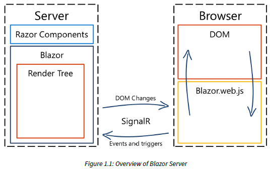
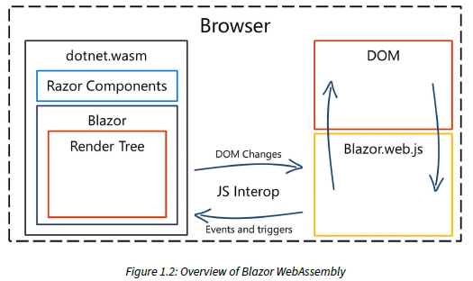

# Blazor

Fontes:

* [Web Development With Blazor: A Practical Guide to Building Interactive UIs With C# 12 and .NET 8, by Jimmy Engstrom](https://www.amazon.com/Web-Development-Blazor-practical-interactive/dp/1835465919#:~:text=Web%20Development%20with%20Blazor%20is%20your%20essential%20guide%20to%20building)

## Table of contents

<!-- TOC start (generated with https://github.com/derlin/bitdowntoc) -->

* [Conceitos](#conceitos)
  * [Latência (Latency)](#latência-latency)
  * [Throughput](#throughput)
* [Motivação para usar Blazor](#motivação-para-usar-blazor)
* [O que é Blazor](#o-que-é-blazor)
* [Diferentes maneiras de rodar Blazor](#diferentes-maneiras-de-rodar-blazor)
  * [Blazor Server](#blazor-server)
  * [Blazor WebAssembly](#blazor-webassembly)
  * [SSR (Server-Side Rendering)](#ssr-server-side-rendering)
* [Trabalhando com os 3 tipos de uma só vez](#trabalhando-com-os-3-tipos-de-uma-só-vez)

<!-- TOC end -->

<!-- TOC -->

## Conceitos

<!-- TOC -->

### Latência (Latency)

No desenvolvimento de software web, latência se refere ao tempo decorrido entre a ação de um usuário e a resposta do servidor. Essencialmente, é o tempo que os dados levam para viajar da fonte (como o navegador de um usuário) para o destino (como um servidor web) e voltar novamente.

Por exemplo, quando você clica em um link em uma página web, latência é o tempo que o servidor leva para processar essa solicitação e enviar os dados necessários de volta para o seu navegador. Menor latência significa tempos de resposta mais rápidos, o que é crucial para uma boa experiência de usuário.

<!-- TOC -->

### Throughput

No desenvolvimento de software web, throughput se refere à quantidade de dados ou número de transações que um sistema pode processar dentro de um período específico. É uma medida de quanto trabalho pode ser concluído em um determinado período de tempo, geralmente expresso em termos de solicitações por segundo, transações por segundo ou bits/bytes por segundo.

Por exemplo, se um aplicativo web pode lidar com 100 solicitações por segundo, seu throughput é de 100 solicitações por segundo. Um alto throughput indica que o sistema pode processar um grande número de transações rapidamente, o que é crucial para desempenho e escalabilidade.

<!-- TOC -->

## Motivação para usar Blazor

Blazor surgiu como uma alternativa ao uso de JavaScript e seus frameworks (React, Angular, Vue, etc) em SPAs. A idea é conseguir criar aplicações web responsivas apenas utilizando C#.

De outra forma, deixa de ser necessário aprender várias das tecnologias envolvidas na Web, utilizando apenas a linguagem que desenvolvedores C# já conhecem.

<!-- TOC -->

## O que é Blazor

Blazor é Framework de UI open-source no qual você pode criar aplicativos web interativos usando HTML, CSS e C# com suporte total para bindings, eventos, formulários e validação, injeção de dependência, depuração e muito mais.

<!-- TOC -->

## Diferentes maneiras de rodar Blazor

* Blazor Server
* Blazor WebAssembly
* Blazor Hybrid (usando .NET MAUI)
* SSR (Server-Side Rendering)

<!-- TOC -->

### Blazor Server

O Blazor Server usa o SignalR para comunicação entre o cliente e o servidor, conforme mostrado no diagrama a seguir:

SignalR é uma biblioteca de comunicação em tempo real que cria uma conexão entre o cliente e o servidor. O SignalR pode usar muitos meios diferentes de transporte de dados e seleciona automaticamente o melhor protocolo de transporte com base nas capacidades do seu servidor e cliente. O SignalR sempre tentará usar WebSockets, que é um protocolo de transporte integrado ao HTML5. Se o WebSockets não estiver habilitado, ele selecionará outro protocolo.

O Blazor é criado com elementos de UI reutilizáveis ​​chamados **componentes**. Cada componente contém código C# e marcação. Um componente
pode incluir outros componentes. Você pode usar a sintaxe Razor para misturar marcação e código C# ou fazer tudo em C#, se desejar. Os componentes podem ser atualizados pela interação do usuário (pressionando um botão) ou gatilhos (como um cronômetro).

Os componentes são renderizados em uma árvore de renderização, uma representação binária do DOM contendo estados de objetos e quaisquer propriedades ou valores. A árvore de renderização manterá o controle de quaisquer alterações em comparação com a árvore de renderização anterior e, em seguida, enviará apenas as coisas que mudaram no SignalR usando um formato binário para atualizar o DOM.

O JavaScript receberá as alterações no lado do cliente e atualizará a página de acordo. Se compararmos isso ao ASP.NET tradicional, renderizamos apenas o componente em si, não a página inteira, e enviamos apenas as alterações reais para o DOM, não a página inteira.

Existem vantagens no Blazor Server:

* Ele contém apenas código suficiente para estabelecer que a conexão seja baixada para o cliente, então o site tem um pequeno footprint, o que torna a inicialização do site muito rápida.
* Como tudo é renderizado no servidor, o Blazor Server é mais amigável ao SEO.
* Como estamos executando no servidor, o aplicativo pode utilizar totalmente os recursos do servidor.
* O site funcionará em navegadores da web mais antigos que não suportam WebAssembly.
* O código é executado no servidor e permanece no servidor; não há como descompilar o código.
* Como o código é executado no seu servidor (ou na nuvem), você pode fazer chamadas diretas para serviços e bancos de dados dentro da sua organização.

Existem, é claro, algumas desvantagens no Blazor Server também:

* Você precisa estar sempre conectado ao servidor, pois a renderização é feita no servidor. Se você tiver uma conexão de internet ruim, o site pode não funcionar. A grande diferença em comparação a um site que não seja do Blazor Server é que um site que não seja do Blazor Server pode entregar uma página e então desconectar até que solicite outra página. Com o Blazor, essa conexão (SignalR) deve estar sempre conectada (pequenas desconexões são aceitáveis).
* Não há modo offline/PWA (Progressive Web App), pois ele precisa estar conectado.
* Cada clique ou atualização de página deve fazer uma viagem de ida e volta para o servidor, o que pode resultar em maior latência. É importante lembrar que o Blazor Server enviará apenas os dados alterados.
* Como precisamos ter uma conexão com o servidor, a carga naquele servidor aumenta e dificulta o scaling. Para resolver esse problema, você pode usar o hub do Azure SignalR para lidar com as conexões constantes e deixar seu servidor se concentrar na entrega de conteúdo.
* Cada conexão armazena as informações na memória do servidor, aumentando o uso da memória e dificultando o balanceamento de carga.
* Para poder executar o Blazor Server, você precisa hospedá-lo em um servidor habilitado para ASP.NET Core.

<!-- TOC -->

### Blazor WebAssembly

O runtime Mono é uma ferramenta que permite que você execute programas feitos com C# e outras linguagens .NET em vários sistemas operacionais, não apenas Windows.

A Microsoft pegou o runtime Mono (que é escrito em C) e o compilou no WebAssembly.

A versão WebAssembly do Blazor funciona de forma muito similar à versão do servidor, como mostrado no diagrama a seguir. Movemos tudo para fora do servidor, e agora está rodando dentro do nosso navegador da web:

Uma árvore de renderização ainda é criada e, em vez de executar as páginas do Razor no servidor, elas agora estão sendo executadas dentro do nosso navegador da web. Em vez do SignalR, como o WebAssembly não tem acesso direto ao DOM, o Blazor atualiza o DOM com interoperabilidade direta de JavaScript.

O runtime do Mono que é compilado no WebAssembly é chamado dotnet.wasm. A página contém um pequeno pedaço de JavaScript que garantirá o carregamento do dotnet.wasm. Em seguida, ele baixará o blazor.boot.json, um arquivo JSON contendo todos os arquivos que o aplicativo precisa para ser executado, bem como o ponto de entrada do aplicativo.

Se olharmos para o site de amostra padrão que é criado quando iniciamos um novo projeto Blazor no Visual Studio, o arquivo Blazor.boot.json contém 63 dependências que precisam ser baixadas. Todas as dependências são baixadas e o aplicativo inicializa.

Como mencionamos anteriormente, dotnet.wasm é o runtime do mono que é compilado no WebAssembly. Ele roda DLLs .NET – aquelas que você escreveu e as do .NET Framework (que são necessárias para rodar seu aplicativo) – no seu navegador.

Parece exagerado rodar todo o runtime do .NET no meu navegador, mas por outro lado você pode rodar qualquer DLL .NET Standard no seu navegador.

Vantagens do Blazor WebAssembly:

* Como o código é executado no navegador, criar um PWA é fácil.
* Não requer conexão com o servidor. O Blazor WebAssembly funcionará offline.
* Como não estamos executando nada no servidor, podemos usar qualquer servidor de backend ou compartilhamento de arquivo (não há necessidade de um servidor compatível com .NET no backend).
* Sem viagens de ida e volta, significa que você pode atualizar a tela mais rápido (é por isso que existem mecanismos de jogo que usam WebAssembly).

Desvantagens no Blazor WebAssembly também:

* Mesmo se compararmos com outros sites grandes, o footprint do Blazor WebAssembly é grande e há muitos arquivos para baixar.
* Para acessar quaisquer recursos no local, você precisará criar uma API da Web para acessá-los. Você não pode acessar o banco de dados diretamente.
* O código é executado no navegador, o que significa que pode ser descompilado. Todos os desenvolvedores de aplicativos estão acostumados com isso, mas não é tão comum para desenvolvedores web.

<!-- TOC -->

### SSR (Server-Side Rendering)

A renderização do lado do servidor é a novata no bloco Blazor. Ela torna possível usar a sintaxe Razor para construir páginas da web que são renderizadas do lado do servidor, assim como MVC ou Razor Pages. Isso é chamado de renderização estática do lado do servidor. Ela tem alguns recursos adicionais que continuarão rolando na posição anterior, mesmo que a página inteira seja recarregada, o que é chamado de navegação de formulário aprimorada. Isso renderizará apenas páginas estáticas, sem interatividade (com algumas exceções). Há também algo chamado renderização de streaming que carregará a página ainda mais rápido. Este modo é chamado de renderização do lado do servidor de streaming. Durante tarefas de longa duração, a renderização de streaming primeiro enviará o HTML que possui e, em seguida, atualizará o DOM assim que a tarefa de longa duração for concluída, dando a ela uma sensação mais interativa.

<!-- TOC -->

## Trabalhando com os 3 tipos de uma só vez

Podemos escolher quais componentes serão executados usando SSR e quais componentes usarão Blazor Server, Blazor WebAssembly ou uma mistura dos dois.

Anteriormente, tínhamos que escolher um dos dois (Blazor Server ou Blazor WebAssembly), mas agora podemos combinar as tecnologias para obter o melhor dos dois mundos. Agora podemos dizer a cada componente como queremos que ele seja renderizado e podemos misturar e combinar em todo o site. O novo recurso “auto” significa que na primeira vez que nossos usuários visitarem o site, eles executarão o Blazor Server. Isso é para obter uma conexão rápida e obter dados para o usuário o mais rápido possível. Em segundo plano, a versão do WebAssembly é baixada e armazenada em cache para que, na próxima vez que visitarem o site, ele use a versão do Blazor WebAssembly em cache. Se a versão do WebAssembly puder ser baixada e iniciada em 100 milissegundos, ela carregará apenas a versão do WebAssembly. Se demorar mais, ele iniciará o Blazor Server e fará o download em segundo plano.

Esta é uma das maneiras pelas quais podemos acelerar a velocidade de download do nosso site Blazor. Podemos combinar todas essas tecnologias, pré-renderizar o conteúdo no servidor usando o Static Server-side Rendering, tornar o site interativo usando Blazor Server (usando SignalR) e, em seguida, alternar para o Blazor WebAssembly sem o "longo" tempo de download.

## Opções durante a criação de um projeto em Blazor

O template **Blazor Web App** (blazor) nos dá um aplicativo Blazor.

Depois de selecionar esse template, obtemos opções:

* Como queremos que nosso aplicativo seja executado. Podemos configurar nosso aplicativo com código de amostra ou sem.
* Podemos escolher se nosso aplicativo deve suportar componentes interativos e que tipo de interatividade queremos.
* Também podemos escolher se queremos especificar o modo de renderização por componente ou para o aplicativo completo. Então, imediatamente, não precisamos escolher se queremos ou não escolher Blazor Server ou Blazor WebAssembly; podemos misturar e combinar.

Se adicionarmos páginas de amostra, obtemos alguns componentes para ver a aparência de um aplicativo Blazor e alguma configuração básica e estrutura de menu. Ele também contém código para adicionar Bootstrap, CSS isolado e coisas assim.

O template **Blazor WebAssembly Standalone App** (blazorwasm) nos dá (como o nome indica) um aplicativo Blazor WebAssembly autônomo. Aqui, podemos escolher:

* Se queremos ter páginas de amostra. Ele contém alguns componentes para ver como é um aplicativo Blazor e alguma configuração básica e estrutura de menu.
* Contém código para adicionar Bootstrap, CSS isolado e coisas assim.

Então por que temos este? Bem, o Blazor Web App depende de tecnologias de renderização de servidor de uma forma ou de outra. Se você quiser executar seu aplicativo a partir de um compartilhamento de arquivos, GitHub Pages ou Azure Static Web Apps (para citar alguns), este é o modelo para você.

### Linha de comando

A linha de comando abaixo cria um projeto Blazor configurado para suportar tanto Blazor Server quanto Blazor WebAssembly e as páginas usarão a renderização estática do servidor por padrão e podem ser marcadas como interativas por página ou por componente.

`dotnet new blazor --name BlazorWebApp --output MyBlog --framework net8.0 --interactivity Auto --auth None --all-interactive false`
