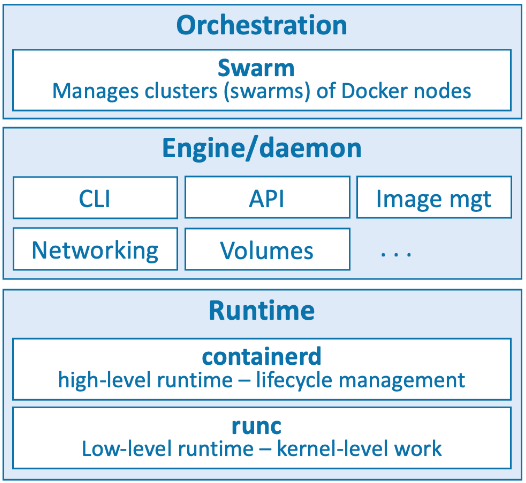

# Table of contents

1. [Conceitos](#conceitos)
1. [Como instalar o Docker](#como-instalar-o-docker)

## Conceitos

### A tecnologia Docker

Quando se fala em Docker como uma tecnologia, 3 partes fundamentais se destacam:

1. O runtime
1. O Daemon (o motor docker)
1. O Orquestrador

O runtime opera no nível mais baixo e é responsável por iniciar e parar contêineres. Docker implementa uma arquitetura de runtime em camadas com runtimes de alto e baixo nível que funcionam juntos.

O runtime de baixo nível é chamado *runc* e é a implementação de referência da especificação de runtime da Open Containers Initiative (OCI). Sua função é fazer interface com o sistema operacional subjacente e iniciar e parar contêineres. Cada contêiner em um nó Docker foi criado e iniciado por uma instância do *runc*.

O runtime de nível superior é chamado *containerd*. Ele gerencia todo o ciclo de vida do contêiner, incluindo baixar imagens e gerenciar as instâncias *runc*. *containerd* é pronunciado “container-dee”. Uma instalação típica do Docker possui um único processo *containerd* de longa duração que instrui o *runc* a iniciar e parar contêineres.

O daemon Docker (dockerd) fica acima do *containerd* e executa tarefas de nível superior, como expor a API Docker, gerenciar imagens, gerenciar volumes, gerenciar redes e muito mais. Uma das principais tarefas do daemon Docker é fornecer uma interface padrão fácil de usar que abstraia os níveis inferiores.

O Docker também possui suporte nativo para gerenciar clusters de nós que executam o Docker. Esses clusters são chamados de *swarms* e a tecnologia nativa é chamada de Docker Swarm. O Docker Swarm é fácil de usar e muitas empresas o utilizam na produção no mundo real. É muito mais simples de instalar e gerenciar do que o Kubernetes, mas carece de muitos dos recursos avançados e do ecossistema do Kubernetes.

[top](#table-of-contents)

## Como instalar o Docker

### Docker Desktop

Baixe o software [aqui](https://hub.docker.com/) e, depois de instalado, você terá um ambiente Docker totalmente funcional, ótimo para desenvolvimento, teste e aprendizado. Inclui Docker Compose e você pode até habilitar um cluster Kubernetes de nó único se precisar aprender Kubernetes. No mesmo site vc encontra o software para Windows ou Mac. No Windows o Docker vai rodar no WSL 2. No Mac o Docker é instalado em um Linux rodando dentro de uma VM.

### Através do Multipass

Multipass é uma ferramenta gratuita para criar VMs Linux no estilo nuvem em sua máquina Linux, Mac ou Windows.

### Docker no Linux

Siga a série de comandos do livro para fazer a instalação no Linux 22.04 LTS

### Play with Docker

[Play with Docker](https://labs.play-with-docker.com/) (PWD) é um playground Docker totalmente funcional baseado na Internet que dura até 4 horas. Você pode adicionar vários nós e até mesmo agrupá-los em um swarm.

[top](#table-of-contents)
