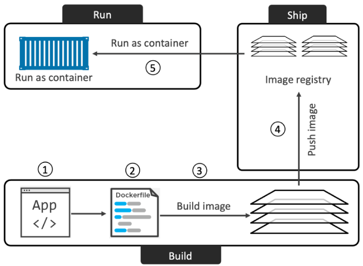

# Docker (Table of contents)

Este é um resumo do livro Docker Deep Dive, do Nigel Poulton, mas também pode ter outros apontamentos de fontes variadas.

1. [Conceitos](#conceitos)
1. [Como instalar o Docker](#como-instalar-o-docker)
1. [Comandos de verificação](#comandos-de-verificação)
1. [Comandos associados a recursos](#comandos-associados-a-recursos)
1. [Como containerizar um app a partir de um fonte do github](#como-containerizar-um-app-a-partir-de-um-fonte-do-github)

## Conceitos

### A tecnologia Docker

Quando se fala em Docker como uma tecnologia, 3 partes fundamentais se destacam:

1. O runtime
1. O Daemon (o motor docker)
1. O Orquestrador


O runtime opera no nível mais baixo e é responsável por iniciar e parar contêineres. Docker implementa uma arquitetura de runtime em camadas com runtimes de alto e baixo nível que funcionam juntos.

O runtime de baixo nível é chamado *runc* e é a implementação de referência da especificação de runtime da Open Containers Initiative (OCI). Sua função é fazer interface com o sistema operacional subjacente e iniciar e parar contêineres. Cada contêiner em um nó Docker foi criado e iniciado por uma instância do *runc*.

O runtime de nível superior é chamado *containerd*. Ele gerencia todo o ciclo de vida do contêiner, incluindo baixar imagens e gerenciar as instâncias *runc*. *containerd* é pronunciado “container-dee”. Uma instalação típica do Docker possui um único processo *containerd* de longa duração que instrui o *runc* a iniciar e parar contêineres.

O daemon Docker (dockerd) fica acima do *containerd* e executa tarefas de nível superior, como expor a API Docker, gerenciar imagens, gerenciar volumes, gerenciar redes e muito mais. Uma das principais tarefas do daemon Docker é fornecer uma interface padrão fácil de usar que abstraia os níveis inferiores.

O Docker também possui suporte nativo para gerenciar clusters de nós que executam o Docker. Esses clusters são chamados de *swarms* e a tecnologia nativa é chamada de Docker Swarm. O Docker Swarm é fácil de usar e muitas empresas o utilizam na produção no mundo real. É muito mais simples de instalar e gerenciar do que o Kubernetes, mas carece de muitos dos recursos avançados e do ecossistema do Kubernetes.

### Imagem

É útil pensar em uma imagem Docker como um objeto que contém um sistema de arquivos do sistema operacional, um aplicativo e todas as dependências do aplicativo. Se você trabalha com operações, é como um template de máquina virtual. Um template de máquina virtual é essencialmente uma máquina virtual parada. No mundo Docker, uma imagem é efetivamente um contêiner parado. Se você é um desenvolvedor, pode pensar em uma imagem como uma classe.

Se você baixar a imagem de um contêiner de aplicativo, como nginx:latest, obterá uma imagem com um sistema operacional mínimo, bem como o código para executar o aplicativo (NGINX).

Também é importante dizer que cada imagem recebe seu próprio ID exclusivo. Ao fazer referência a imagens, você pode consultá-las usando IDs ou nomes. Se você estiver trabalhando com IDs de imagens, geralmente basta digitar os primeiros caracteres do ID - desde que seja único, o Docker saberá a qual imagem você se refere.

O repositório local de imagens num host Linux é /var/lib/docker/<storage-driver>. Se vc está usando Docker em seu Mac ou PC com Docker Desktop, tudo estará rodando dentro de uma VM.

### Containers

O conceito de container é similar ao conceito de Objeto. Se a imagem é uma classe, o container será um objeto criado a partir de uma imagem. Basicamente um container é uma imagem em execução.

### dockerfile

O Dockerfile é um arquivo de texto que diz ao docker com construir uma imagem docker para um determinado app e suas dependências.

```docker
FROM alpine
LABEL maintainer="<nigelpoulton@hotmail.com>"
RUN apk add --update nodejs nodejs-npm
COPY . /src
WORKDIR /src
RUN  npm install
EXPOSE 8080
ENTRYPOINT ["node", "./app.js"]
```

Para criar uma imagem a partir do dockerfile, use docker build

[top](#docker-table-of-contents)

## Como instalar o Docker

### Docker Desktop

Baixe o software [aqui](https://hub.docker.com/) e, depois de instalado, você terá um ambiente Docker totalmente funcional, ótimo para desenvolvimento, teste e aprendizado. Inclui Docker Compose e você pode até habilitar um cluster Kubernetes de nó único se precisar aprender Kubernetes. No mesmo site vc encontra o software para Windows ou Mac. No Windows o Docker vai rodar no WSL 2. No Mac o Docker é instalado em um Linux rodando dentro de uma VM.

### Através do Multipass

Multipass é uma ferramenta gratuita para criar VMs Linux no estilo nuvem em sua máquina Linux, Mac ou Windows.

### Docker no Linux

Siga a série de comandos do livro para fazer a instalação no Linux 22.04 LTS. Segue o roteiro de instalação no Linux 23.04 e foi também, tudo certo.

### Play with Docker

[Play with Docker](https://labs.play-with-docker.com/) (PWD) é um playground Docker totalmente funcional baseado na Internet que dura até 4 horas. Você pode adicionar vários nós e até mesmo agrupá-los em um swarm.

[top](#docker-table-of-contents)

## Comandos de verificação

| Comando | Descrição
| ----- | ----- |
| `docker version` | Obtém informações sobre as versões e testa se o client e o Deamon (server) estão executando e falando um com o outro |
| `docker info` | Obtém informações mais detalhadas do client e do server sobre os recursos que o Docker está gerenciando, como containers, imagens, volumes... |

## Comandos associados a recursos

| Recurso | Comando | Descrição | Exemplo |
| ---- | ----- | ----- | ------ |
| image | `docker pull` | obtém uma imagem da sua lista de fontes de imagem (default é dockerhub) | `docker pull ubuntu:latest` ou `docker pull nigelpoulton/tu-demo:v2` ou `docker pull gcr.io/google-containers/git-sync:v3.1.5` |
| image | `docker images` | Lista as imagens já baixadas | `docker images` |
| image | `docker build` | constrói uma imagem a partir de um dockerfile | `docker build -t test:latest .` |
| image | `docker rmi` | remover uma imagem que não é mais usada. Não é possível apagar uma imagem que está em uso por um container. Será preciso parar o container e apagá-lo antes de apagar a imagem. | `docker rmi 44dd6f223004` |
| image | `docker rmi $(docker images -q) -f` | remover todas as imagens de uma só vez. | `docker rmi $(docker images -q) -f` |

| container | `docker run <image> <app>` | Executa um container usando uma imagem como base | Ex1: `docker run -it ubuntu:latest /bin/bash`; Ex2: `docker run -d --name web1 --publish 8080:8080 test:latest` |
| container | `docker ps` | Lista os container em execução. Use -a para listar inclusive os containers parados | `docker ps` |
| container | `Press Ctrl-PQ` | para sair do container sem finalizá-lo. O terminal sairá do terminal do container para o terminal do host | |
| container | `docker exec` | anexa seu shell ao terminal de um contêiner em execução | `docker exec -it vigilant_borg bash` |
| container | `docker stop` | Para a execução do container | `docker stop id_container` |
| container | `docker start` | Reinicializa um container parado com o comando stop | `docker start id_container` |
| container | `docker rm` | Elimina o container |`docker rm id_container` |

## Comandos associados ao Docker Hub

| Comando | Descrição | Exemplo |
| ----- | ----- | ------ |
| `docker login` | Fazer login no site para depois subir uma imagem para o registro | `docker login` |
| `docker tag` | Esse comando serve para adicionar uma nova tag a imagem, sem sobrescrever a original. Para subir para o Docker Hub é preciso que a tag seja precedida do seu "id de usuário" | `docker tag ddd-book:ch8.1 nigelpoulton/ddd-book:ch8.1` |
| `docker push` | Comando para subir a imagem para o Docker Hub | `docker push nigelpoulton/ddd-book:ch8.1` |

Para entender as partes envolvidas, considere docker.io/nigelpoulton/ddd-book:ch8.1

* o registro é: docker.io
* o repositório é: nigelpoulton/ddd-book
* a tag é: ch8.1

### Mais sobre imagens

Para filtrar o resultado do comando `docker images` vc pode usar o parâmetro --filter

| Filtro | Descrição | Exemplo |
| ----- | ----- | ----- |
| dangling | Filtra as imagens sem tag, isso geralmente acontece quando uma imagem é atualizada mantendo sua tag original | `docker images --filter dangling=true` |
| before | Requer o nome de uma imagem ou o seu ID e retorna todas as imagens criadas antes dela | `docker images --filter before=98523` |
| since | Requer o nome de uma imagem ou o seu ID e retorna todas as imagens criadas depois dela | `docker images --filter since=98523` |
| label | Filtra as imagens com base na presença de um rótulo ou rótulo e valor. O comando Docker Images não exibe rótulos em sua saída. | `docker images --filter label=<key> or label=<key>=<value>` |
| reference | | `docker images --filter=reference="*:latest"` |

Para deletar imagens sem tag use `docker image prune`. Adicione o parâmetro -a para deletar também todas as imagens que não estão sendo usado por nenhum container.

Para buscar no docker hub através do CLI, use o comando `docker search string_busca`. A busca será feita no campo Nome da imagem. Use --filter "is-official=true" para filtrar somente por repositórios oficiais.

`docker search alpine --filter "is-official=true"`

### Mais sobre containers

O parâmetro -it conecta a janela do terminal corrente ao shell do container.

O parâmetro -d executa o container em segundo plano. Os parâmetros -d e -it não podem ser usados ao mesmo tempo.

Os contêineres são executados até que o aplicativo principal saia. Esse exemplo: `docker run -it alpine:latest sleep 10` - executa o commando sleep por 10 segundo e depois encerra a execução do container.

O comando run também tem uma opção para reiniciar um container automaticamente em caso de falha. As opções de reinício são:

|Opção| Descrição | Exemplo |
| ----- | ----- | ----- |
| always | Container será reiniciado logo após o app principal ser finalizado (e por consequência o container ser encerrado) | `docker run --name neversaydie -it --restart always alpine sh` |
| unless-stopped | O container será reiniciado a menos que seja parado com o comando stop | `docker run -d --name unless-stopped --restart unless-stopped alpine sleep 1d` |
| on-failure | reiniciará um contêiner se ele sair com um código de saída diferente de zero. Ele também reiniciará os contêineres quando o Docker Daemon reiniciar, mesmo aqueles que estavam no estado parado. | `docker run --name neversaydie -it --restart on-failure alpine sh` |

## Como containerizar um app a partir de um fonte do github

Contêineres têm tudo a ver com simplificar os processos construir, empacotar e executar um aplicativo. O processo de ponta a ponta se parece com o seguinte:

1. Comece com o código e as dependências do seu aplicativo
1. Crie um DockerFile que descreva seu aplicativo, dependências e como executá -lo
1. Crie uma imagem desse pacote passando o Dockerfile para o comando do Docker Build
1. Submeta a nova imagem para um registro (opcional)
1. Execute um container dessa imagem

A imagem abaixo ilustra o processo:



### Containerize a single-container app

1. Clonar o projeto: `git clone <https://github.com/nigelpoulton/psweb.git>`
1. Entrar na pasta onde está o dockerfile (chamada também de build context): `cd psweb`
1. Verificar se existe um dockerfile: `ls -l`
1. Construir a imagem: `docker build -t test:latest .`
1. Verificar se a imagem foi criada: `docker images`
1. Executar um container a partir da imagem: `docker run -d --name web1 --publish 8080:8080 test:latest`
