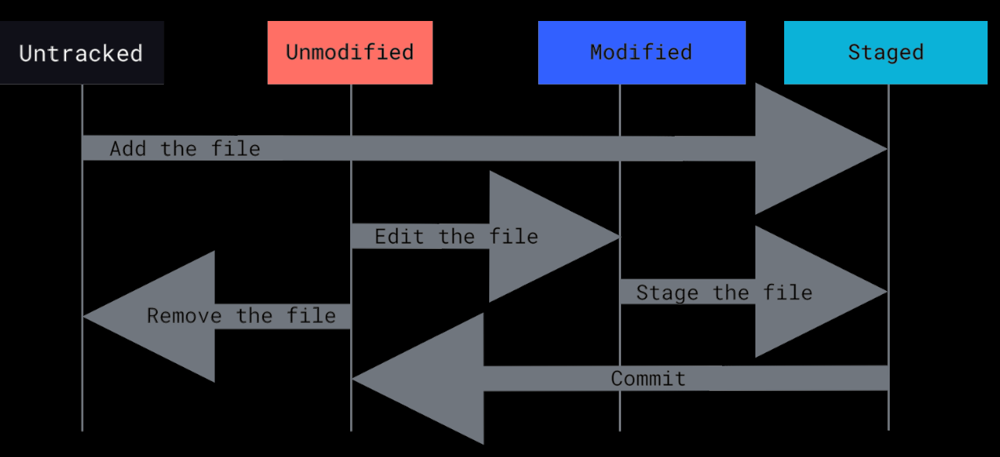

# Git (Table of Contents)

Este é um resumo dos capítulos 2, 3 e 4 do livro Pro Git, do Scott Chacon, mas também pode ter outros apontamentos de fontes variadas.

1. [Help](#help)
1. [Ciclo de vida do status de seus arquivos](#ciclo-de-vida-do-status-de-seus-arquivos)
1. [Getting a git repository](#getting-a-git-repository)
1. [Recording Changes to the Repository](#recording-changes-to-the-repository)
1. [Viewing the Commit History](#viewing-the-commit-history)
1. [Desfazendo as coisas](#desfazendo-as-coisas)
1. [Working with Remotes](#working-with-remotes)
1. [Principais comandos](#principais-comandos)

## Help

If you ever need help while using Git, there are three equivalent ways to get the comprehensive manual page (manpage) help for any of the Git commands:

```git
git help <verb>
git <verb> --help
man git-<verb>
```

 [top](#git-table-of-contents)

## Ciclo de vida do status de seus arquivos



 [top](#git-table-of-contents)

## Getting a git repository

### Init

Para iniciar um repositório, primeiro vá até a pasta desejada e digite o comando:

`git init`

Será criada uma pasta .git com toda a estrutura necessária ao git, porém nenhum arquivo está sendo monitorado. Ainda será necessário realizar o 'add' e o "commit' nos arquivos que deseja monitorar.

Para iniciar um repositório remoto que só irá armazenar as alterações. Ele será o nosso servidor de git. Ninguém irá trabalhar diretamente nesta pasta.

`git init --bare`

### Clone

Para clonar um servidor e atribuir o nome da pasta que ele terá na sua máquina:

`git clone <url> <nome-pasta>`

url pode ser o endereço de um servidor git criado com o git init --bare ou um endereço web válido

Exemplos:

```git
git clone <https://github.com/libgit2/libgit2>
git clone <https://github.com/libgit2/libgit2> mylibgit
```

Para clonar um branch específico de um projeto

`Git clone <url> -b branchName`

Os seguintes protocolos são suportados pelo git:

* https://
* git:// e user@server:path/to/repo.git, which uses the SSH transfer protocol.

[top](#git-table-of-contents)

## Recording Changes to the Repository

### Checking the Status of Your Files

The main tool you use to determine which files are in which state is the `git status` command.

Se quiser uma saída mais simplificada para o comando este comando, use o parâmetro -s ou --short

| Símbolo | Descrição |
| ----------- | ----------- |
| ?? | Arquivos ainda não monitorados pelo git |
| A | new files that have been added to the staging area |
| M | modified files|

```git
$ git status -s
 M README
MM Rakefile
A  lib/git.rb
M  lib/simplegit.rb
?? LICENSE.txt
```

 There are two columns to the output - the left-hand column indicates the status of the staging area and the right-hand column indicates the status of the working tree. So for example in that output, the README file is modified in the working directory but not yet staged, while the lib/simplegit.rb file is modified and staged. The Rakefile was modified, staged and then modified again, so there are changes to it that are both staged and unstaged.

### Tracking New Files

Para levar um arquivo de Untracked para Staged:

```git
git add file_name
git add directory_name
git add .
```

The git add command takes a path name for either a file or a directory; if it’s a directory, the command adds all the files in that directory recursively.

### Staging Modified Files

O comando 'add' também é usando para tornar um aquivo alterado em 'staged for commit'

### Making merge-conflicted files as resolved

Também é usado para tornar 'resolvidos' arquivos com conflito no merge

__git add is a multipurpose command — you use it to begin tracking new files, to stage files, and to do other things like marking merge-conflicted files as
resolved. It may be helpful to think of it more as “add precisely this content to the next commit”__

### Ignoring Files

O arquivo .gitignore é usado para sinalizar ao git quais arquivos na pasta não devem ser monitorados

```git
*.[oa]
*~
```

The first line tells Git to ignore any files ending in “.o” or “.a” — object and archive files that may be the product of building your code. The second line tells Git to ignore all files whose names end with a tilde (~), which is used by many text editors such as Emacs to mark temporary files. You may also
include a log, tmp, or pid directory; automatically generated documentation; and so on.

### Viewing Your Staged and Unstaged Changes

To see what you’ve changed but not yet staged:

`git diff`

If you want to see what you’ve staged that will go into your next commit

`git diff --staged`

This command compares your staged changes to your last commit

### Committing Your Changes

Para commitar tudo que está em staged o comando é:

`git commit`

Remember that anything that is still unstaged — any files you have created or modified that you haven’t run git add on since you edited them — won’t go into this commit. They will stay as modified files on
your disk.

A variante `git commit -v` abrirá o editor da sua preferência com o resultado do 'diff' para que seja possível ver exatamente o que está sendo comitado.

Outro opção é adicionar a mensagem inline:

`git commit -m "mensagem do commit"`

Quando vc precisa corrigir um commit, ou porque esquecer de acrescentar um arquivo ou porque errou na mensagem e deseja corrigir, use o `git add` para acrescentar o que falta e depois use o `commit --amend`. Neste caso o commit anterior nem será exibido no histórico. O nome commit passará a ser a única entrada no histórico.

### Skipping the Staging Area

Adicionando a opção -a ao command `git commit` fará que qualquer arquivo monitorado pelo git, mas ainda não incluído na area de stage, seja adicionado automaticamente. Arquivos não monitorados pelo git ficarão de fora do commit.

### Removing Files

Para remover um arquivo do Git, você tem que removê-lo dos arquivos monitorados (mais precisamente removê-lo da area de stage) e então fazer commit.

`git rm file_name`

Se você já modificou o arquivo ou já o adicionou a area de stage, você deve forçar a remoção com o opção -f.

Se quiser remover o arquivo da area de stage, mas ainda sim quer mantê-lo no disco, use a opção `--cached`. Isso é útil quando você acidentalmente adiciona a area de stage algum arquivo importante, que é necessário para o projeto, mas vc não precisa mantê-lo no Git.

### Renomeando arquivos

Assim como ocorre com o Linux, renomear um arquivo é feito através do comando `mv`.

git mv file_from file_to

O próprio Git considera essa operação com um renomeio.

[top](#git-table-of-contents)

## Viewing the Commit History

Para ver o histórico de alterações do repositório, o comando é o `git log`

De forma padrão, o git log irá exibir a lista de commits na ordem reversa cronologicamente, as mais recentes irão aparece primeiro.

A opção -p ou --patch mostra a diferença adicionada em cada commit e vc ainda pode adicionar um limite na quantidade de commits a serem exibidos.

`git log -p -2`

Outra opção importante é o --pretty que pode ser oneline, short, full, fuller, format

`git log --pretty=oneline -2`

| Opção | Efeito | Exemplo |
| ----- | -----| ----- |
| --since | commits desde | --since=2.weeks --since="2008-01-15" --since="2 years 1 day 3 minutes ago" |
| --until | commits até | --since="2008-01-15" --until="2008-02-15" |
| --author | commits por autor | --author='Junio C Hamano' |
| --grep | filtra por palavra na mensagem | --grep="layout" |

You can specify more than one instance of both the --author and --grep search criteria, which will limit the commit output to commits that match any of the
--author patterns and any of the --grep patterns; however, adding the --all-match option further limits the output to just those commits that match all --grep patterns.

A parte de log tem outras opções muito interessantes sobre filtros, na página 44 até 46.

[top](#git-table-of-contents)

## Desfazendo as coisas

### Retirando um arquivo da area de stage

`git reset HEAD file_name`

O arquivo foi colocado na area de stage com o comando `add`, mas agora vc precisa retira-lo dessa area.

### Desfazendo alterações em arquivo no diretório de trabalho

`git checkout -- file_name`

Aqui o arquivo foi alterado, mas ainda não foi dado o add. Dessa forma ele está alterado, mas não está na area de stage. Ex. git checkout -- CONTRIBUTING.md

[top](#git-table-of-contents)

## Working with Remotes

### Para ver quais servidores remotos estão configurados

```git
git remote (para listar os repositórios remotos que o repositório local conhece)
git remote -v (verbose para listar mais detalhes)
```

### Para fazer um repositório local conhecer um repositório remoto

```git
git remote add <name> <url> (a url pode ser um endereço local, na rede, na web)
git remote add pb <https://github.com/paulboone/ticgit>
```

### Inspecionar um remote

Para obter mais informações sobre um remote, vc usa o comando `git remote show nome_do_remote`. Ex.:  git remote show origin

Esse comando mostra:

* which branch is automatically pushed to when you run git push while on certain branches.
* which remote branches on the server you don’t yet have
* which remote branches you have that have been removed from the server, and multiple local branches that are able to merge automatically with their remote-tracking branch when you run git pull.

### Renomeando um remote

`git remote rename pb paul`

It’s worth mentioning that this changes all your remote-tracking branch names, too. What used to be referenced at pb/master is now at paul/master.

### Removendo um remote

`git remote remove paul`

Once you delete the reference to a remote this way, all remote-tracking branches and configuration settings associated with that remote are also deleted.

### Fetching from Your Remotes

`git fetch remote`

The command goes out to that remote project and pulls down all the data from that remote project that you don’t have yet. After you do this, you should have references to all the branches from that remote, which you can merge in or inspect at any time.

### Pulling from Your Remotes

`git Pull`

If your current branch is set up to track a remote branch (see the next section and Git Branching for more information), you can use the git pull command to automatically fetch and then merge that remote branch into your current branch.

Para baixar um branch específico, use `git pull nome-servidor-remoto nome-branch`

### Diferença entre fetch e pull

It’s important to note that the git fetch command only downloads the data to your local repository — it doesn’t automatically merge it with any of your work or
modify what you’re currently working on. You have to merge it manually into your work when you’re ready. Git pull command will automatically fetch and then merge that remote branch into your current branch.

### Pushing to Your Remotes

para subir um branch criado localmente para servidor remoto

`git push --set-upstream origin nome-branch`

This command works only if you cloned from a server to which you have write access and if nobody has pushed in the meantime. If you and someone else clone at the same time and they push upstream and then you push upstream, your push will rightly be rejected. You’ll have to fetch their work first and incorporate it into yours before you’ll be allowed to push. See Git Branching for more detailed information on how to push to remote servers.

[top](#git-table-of-contents)

## Tagging

Typically, people use this functionality to mark release points (v1.0, v2.0 and so on).

### Listing Your Tags

`git tag`
`git tag -l "v1.8.5*"` -> para listar apenas as tags da série 1.8.5 (-l ou --list)

### Creating annotated Tags

Annotated tags, however, are stored as full objects in the Git database. They’re checksummed; contain the tagger name, email, and date; have a tagging message; and can be signed and verified with GNU Privacy Guard (GPG). It’s generally recommended that you create annotated tags so you can have all this information;

`git tag -a v1.4 -m "my version 1.4"`

### Creating lightweight Tags

A lightweight tag is very much like a branch that doesn’t change — it’s just a pointer to a specific commit. To create a lightweight tag, don’t supply any of the -a, -s, or
-m options, just provide a tag name

`git tag v1.4-lw`

### Tagging Later

Você também pode adicionar tag em commit que já não é o último commit feito. Para isso, comece com o `git log --pretty=oneline` para listar os commits já realizados.

Depois crie a tag adicionando o checksum ou parte dele ao final do commando `git tag -a v1.2 9fceb02`

### Show tag data

You can see the tag data along with the commit that was tagged by using the git show command.

`git show v1.4`

### Levando uma tag para o remote

By default, the git push command doesn’t transfer tags to remote servers. You will have to explicitly push tags to a shared server after you have created them.

`git push origin v1.5`

If you have a lot of tags that you want to push up at once, you can also use the --tags option to the git push command.

`git push origin --tags`

### Deletando tags

Deletando a tag localmente: `git tag -d v1.4-lw`
Depois, para deletar do remoto: `git push origin --delete v1.4-lw`

### Vendo o conteúdo de uma tag

`git checkout 2.0.0`

### Criando um novo branch a partir de uma tag

Se você precisa fazer mudanças, como corrigir um bug em uma versão antiga, por exemplo — você provavelmente irá querer criar um branch:

`git checkout -b version2 v2.0.0`

Se você fizer um commit, seu branch version2 será um pouco diferente de sua tag v2.0.0, pois avançará com suas novas alterações, então tome cuidado.

## Aliases (atalhos)

[top](#git-table-of-contents)

Você pode configurar atalhos no git usando o comando de configuração `git config --global alias`

| Configuração | Comando |
| ------- | ------- |
| git config --global alias.co checkout | git co |
| git config --global alias.br branch | git br |
| git config --global alias.ci commit | git ci |
| git config --global alias.st status | git st |
| git config --global alias.unstage 'reset HEAD --' | git unstage fileA |
| git config --global alias.last 'log -1 HEAD' | git last |

## Principais comandos

[init](#init) | [clone](#clone) | [status](#checking-the-status-of-your-files) | [add](#tracking-new-files) | [diff](#viewing-your-staged-and-unstaged-changes) | [commit](#committing-your-changes) | [rm](#removing-files) | [mv](#renomeando-arquivos) | [log](#viewing-the-commit-history) | [remote](#para-ver-quais-servidores-remotos-estão-configurados) | [fetch](#fetching-from-your-remotes) | [pull](#pulling-from-your-remotes) | [push](#pushing-to-your-remotes) | [tag](#tagging) | [show](#show-tag-data)
